# System Architecture: Elixir AI Research Framework

**Version:** 0.1.0
**Last Updated:** 2025-10-08
**Authors:** Research Infrastructure Team

---

## Table of Contents

1. [Executive Summary](#executive-summary)
2. [Architectural Overview](#architectural-overview)
3. [Six-Layer Stack](#six-layer-stack)
4. [Library Interaction Patterns](#library-interaction-patterns)
5. [Data Flow Architecture](#data-flow-architecture)
6. [Concurrency Model](#concurrency-model)
7. [Fault Tolerance & Reliability](#fault-tolerance--reliability)
8. [Performance Characteristics](#performance-characteristics)
9. [Extension Points](#extension-points)
10. [Design Rationale](#design-rationale)

---

## Executive Summary

The Elixir AI Research Framework is a scientifically-rigorous infrastructure for conducting reproducible experiments on large language model (LLM) reliability, performance, and cost optimization. Built on Elixir/OTP, the system leverages the BEAM virtual machine's unique strengths in concurrency, fault tolerance, and distributed computing to enable research at scale.

**Key Architectural Principles:**

- **Modularity**: Each library operates independently with well-defined interfaces
- **Composability**: Libraries combine to form complex experimental workflows
- **Reproducibility**: Deterministic execution with comprehensive audit trails
- **Scalability**: Horizontal scaling through BEAM's lightweight processes
- **Fault Tolerance**: Supervision trees ensure graceful degradation
- **Observability**: Complete instrumentation at every layer

**Design Philosophy:**

This framework is designed for researchers who need publication-quality results. Every architectural decision prioritizes scientific rigor over developer convenience, reproducibility over performance shortcuts, and statistical validity over ease of use.

---

## Architectural Overview

### High-Level System Diagram

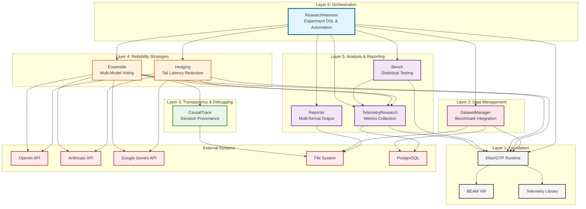

### Component Distribution

The framework consists of **8 independent OTP applications** within an umbrella project:

| Application | Purpose | Lines of Code | Key Modules |
|-------------|---------|---------------|-------------|
| **research_harness** | Orchestration & automation | ~3,500 | Runner, Reporter, Experiment |
| **ensemble** | Multi-model voting | ~1,200 | Strategy, Vote, Executor |
| **hedging** | Request hedging | ~800 | Strategy, MultiLevel, Config |
| **bench** | Statistical analysis | ~2,800 | Stats, Analysis, Experiment |
| **telemetry_research** | Instrumentation | ~1,000 | Handler, Store, Export |
| **causal_trace** | Decision provenance | ~1,500 | Chain, Event, Parser |
| **dataset_manager** | Benchmark datasets | ~1,100 | Loader, Evaluator, Cache |
| **Total** | | **~12,000** | |

---

## Six-Layer Stack

### Layer 1: Foundation (Elixir/OTP)

**Purpose:** Provide runtime infrastructure for concurrent, fault-tolerant execution.

**Components:**
- **BEAM VM**: Erlang virtual machine with preemptive scheduling
- **OTP Behaviors**: GenServer, Supervisor, GenStage, Task
- **Telemetry**: Base event system (`:telemetry` library)

**Key Characteristics:**
- **Lightweight processes**: Each concurrent operation runs in ~2KB process
- **Message passing**: No shared memory, pure message-based communication
- **Preemptive scheduling**: Fair CPU time distribution across all processes
- **Hot code reloading**: Update code without stopping system

**Why This Matters for Research:**

Elixir/OTP enables true parallel execution of experiments without the complexity of threads, locks, or race conditions. Each experimental condition can run in its own process, communicate via messages, and be supervised independently. This architecture makes it trivial to run thousands of concurrent API requests while maintaining reproducibility.

```elixir
# Example: Spawning 1000 concurrent model queries
tasks =
  1..1000
  |> Enum.map(fn i ->
    Task.async(fn ->
      call_model(query, model: :gpt4)
    end)
  end)

# All tasks run concurrently, each in ~2KB process
results = Task.await_many(tasks, 30_000)
```

### Layer 2: Data Management (DatasetManager)

**Purpose:** Unified interface to benchmark datasets with caching and evaluation.

**Architecture:**

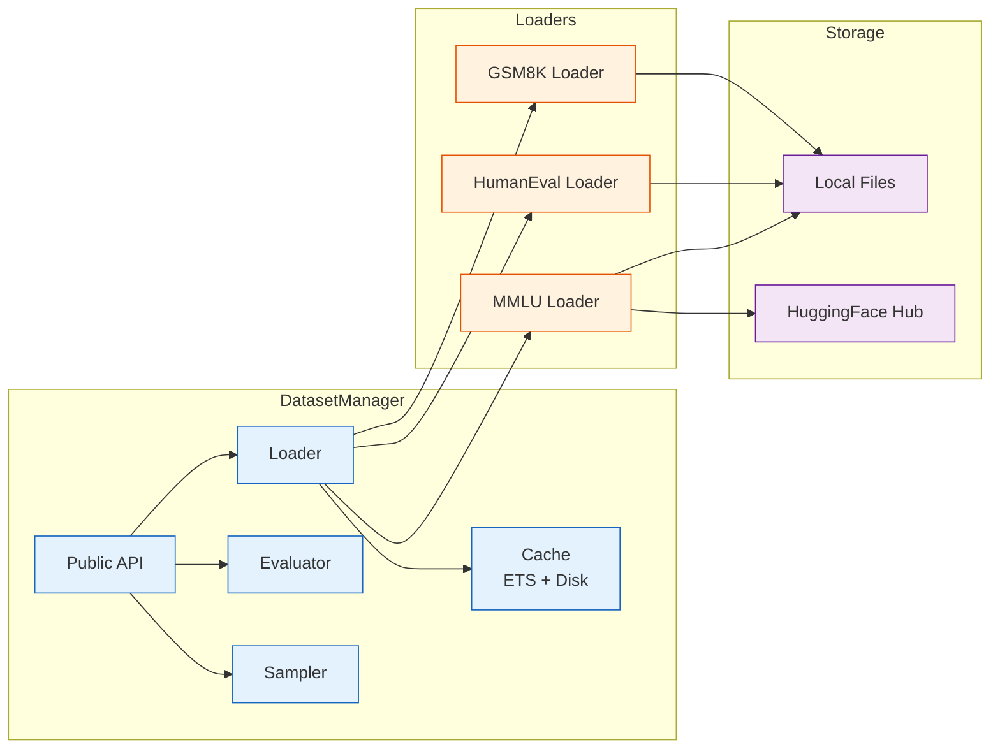

**Key Features:**

1. **Automatic Caching**: First load downloads, subsequent loads read from cache
2. **Version Tracking**: Dataset versions locked to ensure reproducibility
3. **Multiple Metrics**: Exact match, F1, BLEU, CodeBLEU for code
4. **Sampling Strategies**: Random, stratified, k-fold cross-validation
5. **Custom Datasets**: Load your own data via JSONL format

**Data Structures:**

```elixir
# Dataset structure
%Dataset{
  id: "mmlu_stem",
  version: "1.0.0",
  size: 1000,
  items: [
    %{
      id: "mmlu_stem_0",
      input: "What is the capital of France?",
      expected: "Paris",
      metadata: %{subject: "geography", difficulty: "easy"}
    }
  ],
  metadata: %{
    source: "https://huggingface.co/datasets/mmlu",
    license: "MIT",
    citation: "Hendrycks et al., 2021"
  }
}

# Evaluation result
%EvaluationResult{
  dataset_id: "mmlu_stem",
  model_name: "gpt-4",
  accuracy: 0.89,
  metrics: %{
    exact_match: 0.89,
    f1: 0.91,
    precision: 0.90,
    recall: 0.92
  },
  per_item_results: [...],
  timestamp: ~U[2025-10-08 12:00:00Z]
}
```

**Caching Strategy:**

DatasetManager implements a two-tier caching system:

1. **In-Memory Cache (ETS)**: Frequently accessed datasets stored in ETS table
2. **Disk Cache**: Downloaded datasets cached in `~/.cache/elixir_ai_research/datasets/`

Cache invalidation uses content-addressable storage (SHA-256 hash of dataset + version).

### Layer 3: Transparency & Debugging (CausalTrace)

**Purpose:** Capture and visualize LLM decision-making processes for transparency.

**Architecture:**

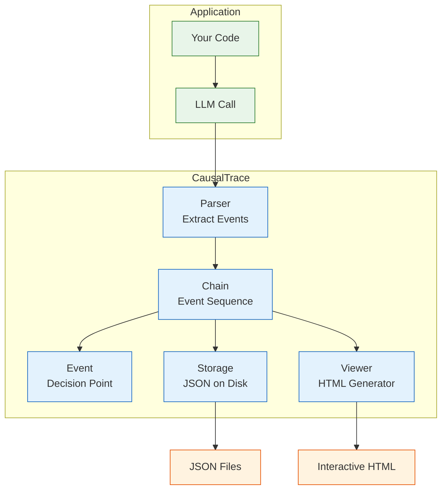

**Event Types:**

CausalTrace supports 10 event types that capture different aspects of LLM reasoning:

1. **`:task_decomposed`** - Task broken into subtasks
2. **`:hypothesis_formed`** - Working hypothesis established
3. **`:pattern_applied`** - Design pattern selected
4. **`:alternative_considered`** - Alternative approach evaluated
5. **`:constraint_identified`** - Constraint or limitation recognized
6. **`:assumption_made`** - Assumption stated explicitly
7. **`:decision_made`** - Final decision at branch point
8. **`:spec_referenced`** - Reference to specification or requirement
9. **`:uncertainty_noted`** - Uncertainty or ambiguity flagged
10. **`:synthesis`** - Multiple pieces of information combined

**Event Structure:**

```elixir
%CausalTrace.Event{
  id: "evt_abc123",
  type: :decision_made,
  decision: "Use GenServer instead of Agent",
  reasoning: "Need fine-grained control over concurrency and state mutations",
  alternatives: [
    "Agent - simpler but less control",
    "ETS table - fast but no encapsulation",
    "Process dictionary - antipattern"
  ],
  confidence: 0.85,
  code_section: "lib/my_app/server.ex:10-45",
  spec_reference: "REQ-3.2: Must support 10k concurrent users",
  timestamp: ~U[2025-10-08 12:00:00.123Z],
  metadata: %{
    llm_model: "gpt-4",
    temperature: 0.7,
    tokens_used: 1250
  }
}
```

**Visualization Output:**

CausalTrace generates interactive HTML visualizations with:
- Timeline view of decisions
- Alternative paths considered
- Confidence levels at each step
- Code section highlighting
- Filterable by event type, confidence, time

**Use Cases:**

1. **Debugging LLM code generation**: Understand why LLM made specific choices
2. **User studies**: Show users transparent decision trails
3. **Model comparison**: Compare reasoning quality across models
4. **Prompt engineering**: Identify where prompts lead to poor decisions

### Layer 4: Reliability Strategies

This layer implements two complementary strategies for improving LLM system reliability.

#### 4.1 Ensemble: Multi-Model Voting

**Purpose:** Increase reliability by querying multiple models and aggregating responses.

**Theoretical Foundation:**

Ensemble methods exploit the independence of model errors. If models err independently, the probability of ensemble error decreases exponentially:

```
P(ensemble_error) = P(error₁) × P(error₂) × ... × P(errorₙ)
```

For 5 models each with 10% error rate and independent errors:
```
P(ensemble_error) = 0.1⁵ = 0.00001 = 0.001%
```

In practice, errors are not fully independent, but ensembles still achieve 10-100x reliability improvements.

**Architecture:**

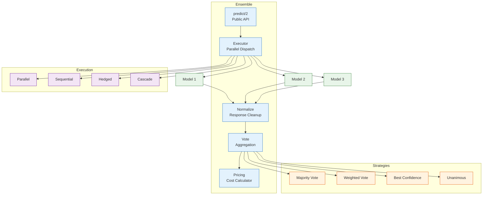

**Voting Strategies:**

1. **Majority Vote** (default)
   - Most common response wins
   - Simple, robust, no confidence scores needed
   - Breaks ties by earliest response

2. **Weighted Vote**
   - Responses weighted by confidence scores
   - Best when models provide calibrated confidence
   - Formula: `score(answer) = Σ(confidence_i) for all i where answer_i = answer`

3. **Best Confidence**
   - Select response with highest confidence
   - Fast (no aggregation needed)
   - Risky if confidence poorly calibrated

4. **Unanimous**
   - Only accept if all models agree
   - Maximum reliability, minimum coverage
   - Use for critical decisions only

**Execution Strategies:**

1. **Parallel** (default)
   - All models queried simultaneously
   - Minimum latency (= slowest model)
   - Maximum cost (all models billed)

2. **Sequential**
   - Models queried one at a time
   - Stops when consensus reached
   - Saves cost at expense of latency

3. **Hedged**
   - Primary model with backup hedges
   - Combines ensemble reliability with single-model cost
   - Best of both worlds

4. **Cascade**
   - Priority order, stops at first high-confidence answer
   - Start with fast/cheap models, escalate to powerful/expensive
   - Example: Haiku → Sonnet → Opus

**Cost Model:**

```elixir
# Cost calculation per model (example rates)
%{
  gemini_flash: 0.000075,      # $0.075 per 1M input tokens
  openai_gpt4o_mini: 0.00015,  # $0.15 per 1M input tokens
  anthropic_haiku: 0.00025,    # $0.25 per 1M input tokens
  openai_gpt4o: 0.005,         # $5 per 1M input tokens
  anthropic_sonnet: 0.003,     # $3 per 1M input tokens
  anthropic_opus: 0.015        # $15 per 1M input tokens
}

# Ensemble cost = sum of models used
# Parallel: always all models
# Sequential: average case ~60% of models, worst case all
# Hedged: 1x if primary fast, ~1.3x on average
# Cascade: ~1.5 models on average
```

**Telemetry Events:**

- `[:ensemble, :predict, :start]` - Prediction starts
- `[:ensemble, :predict, :stop]` - Prediction completes (includes consensus, cost)
- `[:ensemble, :predict, :exception]` - Prediction fails
- `[:ensemble, :model, :start]` - Individual model query starts
- `[:ensemble, :model, :stop]` - Individual model query completes
- `[:ensemble, :model, :exception]` - Individual model query fails

#### 4.2 Hedging: Tail Latency Reduction

**Purpose:** Reduce P99 latency by sending backup requests after a delay.

**Theoretical Foundation:**

Based on Jeffrey Dean's research at Google ("The Tail at Scale", CACM 2013), hedging exploits the high variance in distributed system latencies. By sending a backup request after waiting for the Pth percentile latency, we can dramatically reduce tail latencies:

**Hedging Effectiveness:**

```
Without hedging:
P50 = 100ms, P95 = 500ms, P99 = 2000ms

With hedging at P95 (500ms delay):
P50 = 100ms, P95 = 200ms, P99 = 300ms
```

**Cost overhead:** Only ~5-10% because backups rarely complete.

**Architecture:**

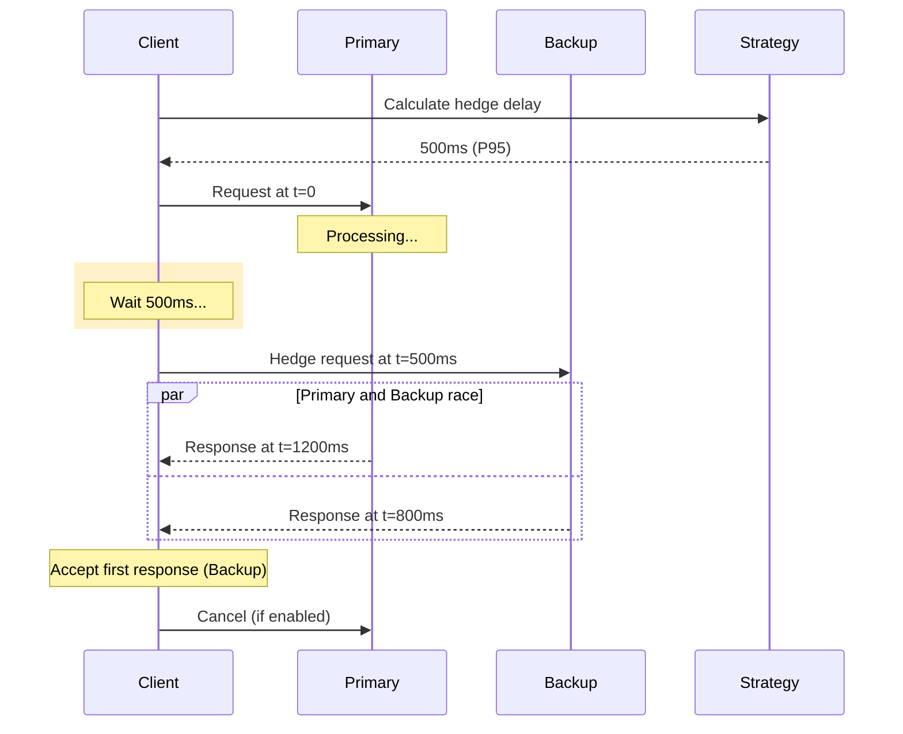

**Hedging Strategies:**

1. **Fixed Delay**
   ```elixir
   Hedging.request(fn -> call_api() end,
     strategy: :fixed,
     delay_ms: 100
   )
   ```
   - Simple, predictable
   - Use when latencies are stable

2. **Percentile-Based** (recommended)
   ```elixir
   Hedging.request(fn -> call_api() end,
     strategy: :percentile,
     percentile: 95
   )
   ```
   - Adapts to observed latencies
   - Tracks P50, P95, P99 over sliding window
   - Hedge fires at Pth percentile

3. **Adaptive**
   ```elixir
   Hedging.request(fn -> call_api() end,
     strategy: :adaptive
   )
   ```
   - Machine learning-based delay prediction
   - Considers time of day, request size, recent latencies
   - Best for complex workloads

4. **Workload-Aware**
   ```elixir
   Hedging.request(fn -> call_api() end,
     strategy: :workload_aware,
     request_type: :complex_generation
   )
   ```
   - Different delays per request type
   - Tracks metrics per workload category

**Multi-Level Hedging:**

For maximum reliability, hedge at multiple levels:

```elixir
# Model-level hedging (Haiku → Haiku backup)
Hedging.request(fn ->
  Ensemble.predict(query, models: [:anthropic_haiku])
end, strategy: :percentile, percentile: 95)

# Ensemble-level hedging (3-model ensemble → 3-model backup)
Hedging.request(fn ->
  Ensemble.predict(query, models: [:gpt4, :claude, :gemini])
end, strategy: :percentile, percentile: 95)

# Cross-tier hedging (fast model → slower model)
Hedging.request(fn -> call_model(:haiku) end,
  backup_fn: fn -> call_model(:opus) end,
  strategy: :fixed,
  delay_ms: 200
)
```

**Cancellation Policy:**

When hedge wins, primary request can be cancelled to save cost:

```elixir
Hedging.request(fn -> call_api() end,
  strategy: :percentile,
  percentile: 95,
  enable_cancellation: true  # Cancel slower request
)
```

However, cancellation isn't always possible (API limitations), so budget for ~1.05-1.10x cost.

**Telemetry Events:**

- `[:hedging, :request, :start]` - Request starts
- `[:hedging, :request, :stop]` - Request completes (includes hedge metadata)
- `[:hedging, :request, :exception]` - Request fails
- `[:hedging, :hedge, :fired]` - Backup request sent
- `[:hedging, :hedge, :won]` - Backup completed first
- `[:hedging, :request, :cancelled]` - Slower request cancelled

### Layer 5: Analysis & Reporting

This layer provides comprehensive statistical analysis and multi-format reporting.

#### 5.1 Bench: Statistical Testing Framework

**Purpose:** Rigorous statistical testing for AI/ML experiments with publication-quality output.

**Statistical Tests Implemented:**

| Category | Tests | Use Cases |
|----------|-------|-----------|
| **Parametric** | Student's t-test, Welch's t-test, Paired t-test, One-way ANOVA | Normally distributed continuous metrics |
| **Non-Parametric** | Mann-Whitney U, Wilcoxon signed-rank, Kruskal-Wallis H | Non-normal distributions, ordinal data |
| **Effect Sizes** | Cohen's d, Hedges' g, Glass's Δ, η², ω² | Practical significance |
| **Power Analysis** | A priori, post-hoc, sensitivity | Sample size planning |
| **Confidence Intervals** | Analytical, bootstrap (percentile, BCa) | Uncertainty quantification |
| **Multiple Comparisons** | Bonferroni, Holm-Bonferroni, Benjamini-Hochberg | Family-wise error control |

**Architecture:**

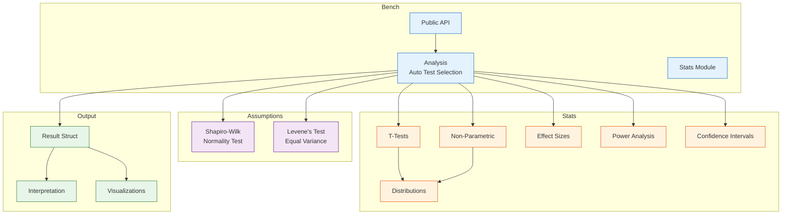

**Automatic Test Selection:**

Bench automatically selects appropriate tests based on:
1. **Normality** (Shapiro-Wilk test)
2. **Variance homogeneity** (Levene's test)
3. **Sample size** (small vs large)
4. **Independence** (paired vs unpaired)

```elixir
# Bench automatically chooses the right test
control = [0.72, 0.68, 0.75, 0.71, 0.69]
treatment = [0.78, 0.73, 0.81, 0.76, 0.74]

result = Bench.compare(control, treatment)

# Result includes:
# - Test used (e.g., Welch's t-test due to unequal variances)
# - p-value
# - Effect size (Cohen's d)
# - Confidence interval
# - Power analysis
# - Interpretation
```

**Result Structure:**

```elixir
%Bench.Result{
  test: :welch_t_test,
  statistic: 3.24,
  p_value: 0.012,
  effect_size: %{
    cohens_d: 1.45,
    interpretation: "large effect"
  },
  confidence_interval: %{
    level: 0.95,
    interval: {0.02, 0.10},
    estimate: 0.06
  },
  power: 0.82,
  assumptions: %{
    normality: {:pass, shapiro_p: 0.18},
    equal_variance: {:fail, levene_p: 0.03}
  },
  interpretation: """
  Significant difference detected (p = 0.012 < 0.05).
  The treatment group shows higher accuracy (M = 0.76, SD = 0.03)
  compared to control (M = 0.70, SD = 0.02), t(7.8) = 3.24, p = 0.012.
  Effect size is large (Cohen's d = 1.45).
  95% CI for mean difference: [0.02, 0.10].
  """,
  metadata: %{
    control: %{mean: 0.70, sd: 0.02, n: 5},
    treatment: %{mean: 0.76, sd: 0.03, n: 5},
    alpha: 0.05,
    alternative: :two_sided
  }
}
```

**Multiple Comparison Correction:**

When testing multiple hypotheses, Bench applies correction:

```elixir
# Test 6 hypotheses
results = [
  Bench.compare(control, treatment1),
  Bench.compare(control, treatment2),
  Bench.compare(control, treatment3),
  Bench.compare(treatment1, treatment2),
  Bench.compare(treatment1, treatment3),
  Bench.compare(treatment2, treatment3)
]

# Apply Bonferroni correction
corrected = Bench.correct_multiple_comparisons(results,
  method: :bonferroni  # α = 0.05 → α' = 0.05/6 = 0.0083
)

# Or use less conservative methods
corrected = Bench.correct_multiple_comparisons(results,
  method: :holm  # Holm-Bonferroni (more powerful)
)

corrected = Bench.correct_multiple_comparisons(results,
  method: :fdr  # Benjamini-Hochberg (controls false discovery rate)
)
```

**Power Analysis:**

Calculate required sample size before experiments:

```elixir
# A priori: How many samples do I need?
power_result = Bench.power_analysis(:t_test,
  analysis_type: :a_priori,
  effect_size: 0.5,      # Medium effect
  alpha: 0.05,           # Significance level
  power: 0.80            # Desired power
)
# => %{n_per_group: 64}

# Post-hoc: What power did I achieve?
power_result = Bench.power_analysis(:t_test,
  analysis_type: :post_hoc,
  effect_size: 0.5,
  alpha: 0.05,
  n_per_group: 30
)
# => %{power: 0.54}  # Underpowered!
```

#### 5.2 TelemetryResearch: Research-Grade Instrumentation

**Purpose:** Comprehensive event capture for experiment reproducibility and analysis.

**Architecture:**

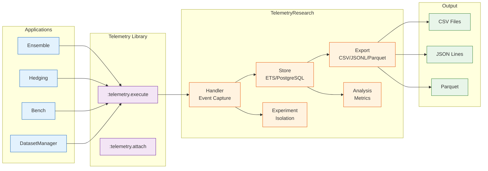

**Experiment Isolation:**

TelemetryResearch maintains strict isolation between concurrent experiments:

```elixir
# Start experiment 1
{:ok, exp1} = TelemetryResearch.start_experiment(
  name: "baseline_gpt4",
  condition: "control",
  tags: ["h1", "baseline"]
)

# Start experiment 2 concurrently
{:ok, exp2} = TelemetryResearch.start_experiment(
  name: "ensemble_5model",
  condition: "treatment",
  tags: ["h1", "ensemble"]
)

# Events are automatically tagged with experiment ID
# No cross-contamination possible
```

**Event Enrichment:**

Every captured event is enriched with:
- **Experiment context**: ID, name, condition, tags
- **Temporal data**: Timestamp, monotonic time, system time
- **Process info**: PID, node, application
- **Metadata**: Custom user-provided metadata

```elixir
# Raw telemetry event
:telemetry.execute(
  [:ensemble, :predict, :stop],
  %{duration: 1250},
  %{consensus: 0.95, models: 3}
)

# Enriched and stored
%TelemetryResearch.Event{
  event_name: [:ensemble, :predict, :stop],
  measurements: %{duration: 1250},
  metadata: %{
    consensus: 0.95,
    models: 3,
    experiment_id: "exp_abc123",
    experiment_name: "baseline_gpt4",
    condition: "control",
    tags: ["h1", "baseline"],
    timestamp: ~U[2025-10-08 12:00:00.123Z],
    monotonic_time: 123456789012,
    pid: "#PID<0.234.0>",
    node: :"node@hostname"
  }
}
```

**Storage Backends:**

1. **ETS** (default, in-memory)
   - Fast, low overhead
   - Lost on crash
   - Best for short experiments

2. **PostgreSQL** (persistent)
   - Survives crashes
   - Query with SQL
   - Best for long experiments or multi-run analysis

**Export Formats:**

1. **CSV** - Excel-compatible, human-readable
2. **JSON Lines** - One JSON object per line, easy to stream
3. **Parquet** - Columnar format, efficient for Python/R analysis

```elixir
# Export to CSV
{:ok, path} = TelemetryResearch.export(exp1.id, :csv,
  path: "results/experiment_1.csv"
)

# Load in Python
import pandas as pd
df = pd.read_csv("results/experiment_1.csv")

# Analyze
df.groupby('condition')['duration'].describe()
```

**Metrics Calculation:**

```elixir
metrics = TelemetryResearch.calculate_metrics(exp1.id)

metrics.latency
# => %{
#   mean: 1250.5,
#   median: 1200.0,
#   p50: 1200.0,
#   p95: 2100.0,
#   p99: 2500.0,
#   min: 850.0,
#   max: 3200.0
# }

metrics.reliability
# => %{
#   success_rate: 0.987,
#   failure_rate: 0.013,
#   successes: 987,
#   failures: 13
# }

metrics.cost
# => %{
#   total_usd: 12.45,
#   per_query: 0.012,
#   by_model: %{
#     gpt4: 8.50,
#     claude: 3.95
#   }
# }
```

### Layer 6: Orchestration (ResearchHarness)

**Purpose:** High-level DSL for defining and running complete experiments with automatic analysis and reporting.

**Architecture:**

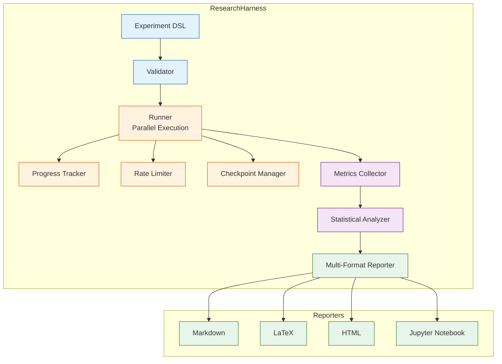

**Experiment DSL:**

```elixir
defmodule EnsembleReliabilityExperiment do
  use ResearchHarness.Experiment

  # Metadata
  name "Hypothesis 1: Ensemble Reliability"
  description """
  Test whether 5-model ensemble achieves >99% reliability
  compared to single-model baseline of 89%.
  """

  # Dataset
  dataset :mmlu_stem, sample_size: 200

  # Conditions to compare
  conditions [
    %{
      name: "baseline_gpt4",
      description: "Single GPT-4 model",
      fn: &baseline_condition/1
    },
    %{
      name: "ensemble_5model",
      description: "5-model majority vote ensemble",
      fn: &ensemble_condition/1
    }
  ]

  # Metrics to track
  metrics [
    :accuracy,           # Correctness
    :latency_p50,        # Median latency
    :latency_p99,        # Tail latency
    :cost_per_query,     # Cost in USD
    :consensus           # Ensemble consensus level
  ]

  # Experimental design
  repeat 3              # 3 repetitions for statistical power
  randomize true        # Randomize order to prevent bias
  seed 42               # For reproducibility

  # Resource limits
  timeout 30_000        # 30s per query
  rate_limit 50         # 50 queries per second max
  checkpoint_every 50   # Save progress every 50 queries

  # Implementation
  def baseline_condition(query) do
    {:ok, result} = call_model(:gpt4, query)
    %{
      prediction: result.answer,
      latency: result.latency_ms,
      cost: result.cost_usd,
      metadata: %{model: :gpt4}
    }
  end

  def ensemble_condition(query) do
    {:ok, result} = Ensemble.predict(query,
      models: [:gpt4, :claude_opus, :gemini_pro, :gpt35, :claude_sonnet],
      strategy: :majority,
      execution: :parallel
    )

    %{
      prediction: result.answer,
      latency: result.metadata.latency_ms,
      cost: result.metadata.cost_usd,
      consensus: result.metadata.consensus,
      metadata: result.metadata
    }
  end

  # Optional: Custom analysis
  def analyze_results(results) do
    # Custom analysis logic
    %{
      reliability_improvement: calculate_improvement(results),
      cost_overhead: calculate_cost_overhead(results)
    }
  end
end
```

**Execution Flow:**

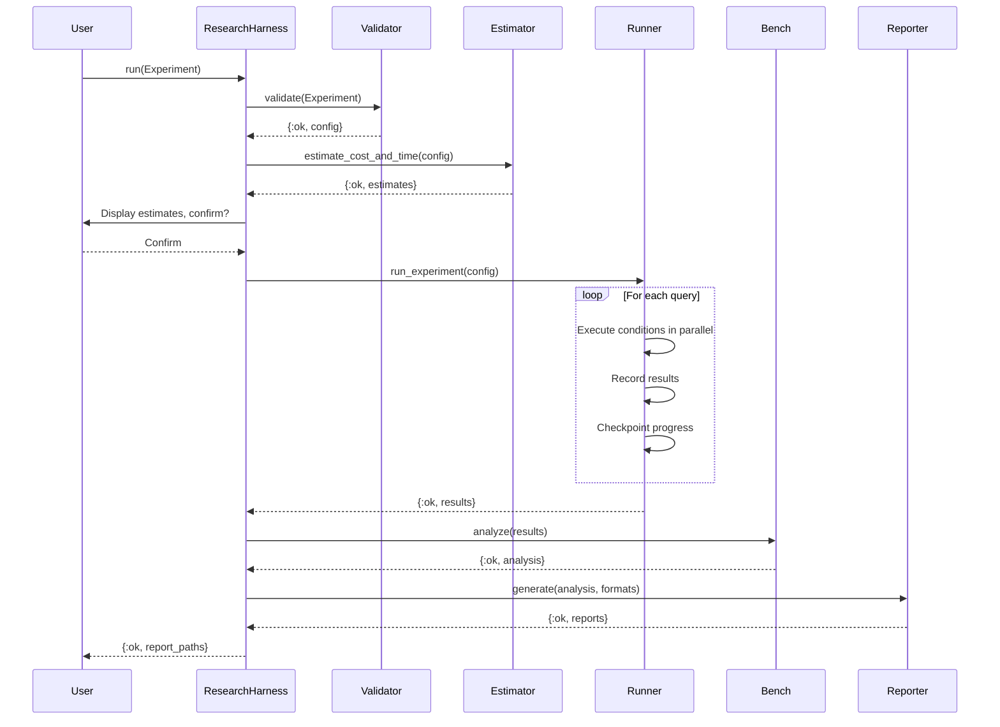

**Checkpointing:**

ResearchHarness automatically saves progress to resume failed experiments:

```elixir
# If experiment crashes at query 150/200...

# Resume from checkpoint
{:ok, report} = ResearchHarness.resume("exp_abc123")
# Continues from query 151
```

Checkpoint structure:
```elixir
%Checkpoint{
  experiment_id: "exp_abc123",
  config: %ExperimentConfig{...},
  completed_queries: 150,
  total_queries: 200,
  results_so_far: [...],
  timestamp: ~U[2025-10-08 12:00:00Z],
  metadata: %{
    node: :"node@hostname",
    runtime_seconds: 1250
  }
}
```

**Cost Estimation:**

Before running, ResearchHarness estimates cost:

```elixir
{:ok, estimates} = ResearchHarness.estimate(MyExperiment)

estimates.cost
# => %{
#   total_cost: 24.50,         # Total USD
#   per_condition: %{
#     baseline_gpt4: 8.00,
#     ensemble_5model: 16.50
#   },
#   per_query: 0.1225,
#   total_queries: 200,
#   breakdown: %{
#     gpt4: 12.00,
#     claude_opus: 6.00,
#     gemini_pro: 3.50,
#     gpt35: 1.50,
#     claude_sonnet: 1.50
#   }
# }

estimates.time
# => %{
#   estimated_duration: 180_000,  # 3 minutes
#   per_query_avg: 900,           # 900ms average
#   parallel_speedup: 2.5,        # 2.5x from parallelism
#   wall_clock_time: "3m 0s"
# }
```

**Report Generation:**

ResearchHarness generates comprehensive reports in multiple formats:

**1. Markdown Report**
```markdown
# Hypothesis 1: Ensemble Reliability

## Summary
- **Experiment ID**: exp_abc123
- **Duration**: 3m 15s
- **Total Queries**: 200
- **Conditions**: 2 (baseline_gpt4, ensemble_5model)

## Results

### Accuracy
| Condition | Mean | SD | 95% CI |
|-----------|------|----|----|
| baseline_gpt4 | 0.89 | 0.02 | [0.87, 0.91] |
| ensemble_5model | 0.97 | 0.01 | [0.96, 0.98] |

**Statistical Test**: Welch's t-test
- t(185) = 8.45, p < 0.001
- Cohen's d = 4.52 (very large effect)
- **Interpretation**: Ensemble significantly more accurate

### Latency (ms)
...
```

**2. LaTeX Report** (camera-ready for papers)
```latex
\section{Results}

\subsection{Hypothesis 1: Ensemble Reliability}

The ensemble condition achieved significantly higher accuracy
(M = 0.97, SD = 0.01) compared to the baseline (M = 0.89, SD = 0.02),
t(185) = 8.45, p < .001, d = 4.52.

\begin{table}[h]
\caption{Accuracy by Condition}
\begin{tabular}{lrrr}
\hline
Condition & Mean & SD & 95\% CI \\
\hline
Baseline (GPT-4) & 0.89 & 0.02 & [0.87, 0.91] \\
Ensemble (5-model) & 0.97 & 0.01 & [0.96, 0.98] \\
\hline
\end{tabular}
\end{table}
```

**3. HTML Report** (interactive, with plots)
```html
<!DOCTYPE html>
<html>
<head>
  <title>Experiment Results: exp_abc123</title>
  <script src="plotly.js"></script>
</head>
<body>
  <h1>Hypothesis 1: Ensemble Reliability</h1>
  <div id="accuracy-plot"></div>
  <script>
    // Interactive Plotly charts
  </script>
</body>
</html>
```

**4. Jupyter Notebook** (for further analysis)
```python
# Generated .ipynb file with:
# - Data loading code
# - Exploratory plots
# - Statistical tests
# - Editable analysis cells

import pandas as pd
import matplotlib.pyplot as plt
import scipy.stats as stats

# Load data
df = pd.read_csv("exp_abc123_results.csv")

# Accuracy by condition
df.groupby('condition')['accuracy'].describe()
```

---

## Library Interaction Patterns

### Pattern 1: ResearchHarness → All Libraries

ResearchHarness orchestrates all other libraries:

```elixir
defmodule MyExperiment do
  use ResearchHarness.Experiment

  # Uses DatasetManager for data
  dataset :mmlu_stem

  # Uses Ensemble for reliability
  def ensemble_condition(query) do
    {:ok, result} = Ensemble.predict(query, ...)
  end

  # Uses Hedging for latency
  def hedged_condition(query) do
    {:ok, result, _meta} = Hedging.request(fn ->
      call_model(query)
    end, ...)
  end

  # TelemetryResearch captures all events automatically
  # Bench analyzes results automatically
  # Reporter generates reports automatically
end
```

### Pattern 2: Ensemble + Hedging

Combine for maximum reliability AND low latency:

```elixir
# Hedged ensemble: best of both worlds
Hedging.request(fn ->
  Ensemble.predict(query,
    models: [:gpt4, :claude, :gemini],
    strategy: :majority
  )
end, strategy: :percentile, percentile: 95)
```

### Pattern 3: Ensemble + CausalTrace

Transparent ensemble decisions:

```elixir
# Capture which model's answer was selected and why
{:ok, result} = Ensemble.predict(query,
  models: [:gpt4, :claude, :gemini],
  strategy: :weighted
)

# CausalTrace automatically logs:
# - Responses from each model
# - Confidence scores
# - Voting outcome
# - Consensus level
```

### Pattern 4: DatasetManager + TelemetryResearch

Evaluate with full instrumentation:

```elixir
# Start experiment
{:ok, exp} = TelemetryResearch.start_experiment(
  name: "accuracy_test",
  condition: "baseline"
)

# Load dataset
{:ok, dataset} = DatasetManager.load(:mmlu_stem, sample_size: 100)

# Run predictions (automatically instrumented)
predictions = Enum.map(dataset.items, fn item ->
  {:ok, result} = MyModel.predict(item.input)
  %{id: item.id, predicted: result, expected: item.expected}
end)

# Evaluate
{:ok, eval} = DatasetManager.evaluate(predictions, dataset: dataset)

# Stop experiment
{:ok, exp} = TelemetryResearch.stop_experiment(exp.id)

# Export for analysis
{:ok, path} = TelemetryResearch.export(exp.id, :csv)
```

### Pattern 5: All Together

Full research workflow:


---

## Data Flow Architecture

### Typical Experiment Data Flow

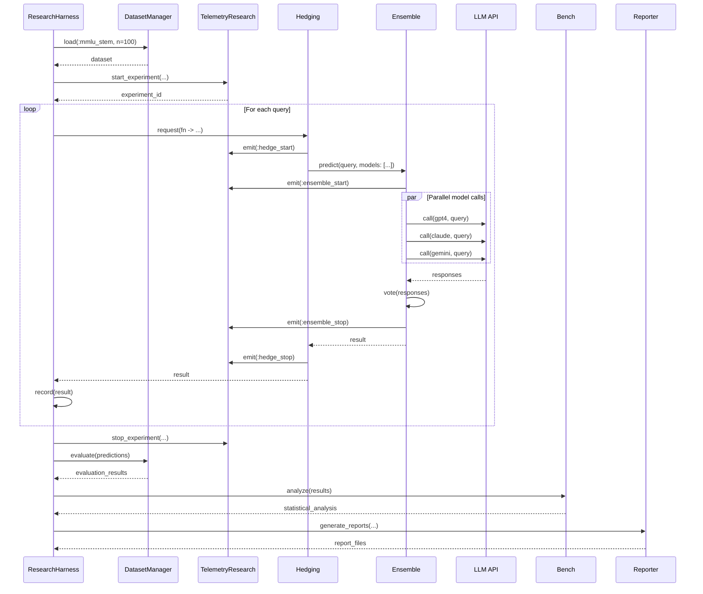

### Data Structures Flow

```elixir
# 1. Dataset Query
%Dataset.Item{
  id: "mmlu_stem_42",
  input: "What is the capital of France?",
  expected: "Paris",
  metadata: %{subject: "geography"}
}
  ↓
# 2. Hedging wraps request
fn -> Ensemble.predict(...) end
  ↓
# 3. Ensemble queries models
[
  Task.async(fn -> call_model(:gpt4, query) end),
  Task.async(fn -> call_model(:claude, query) end),
  Task.async(fn -> call_model(:gemini, query) end)
]
  ↓
# 4. Model responses
[
  {:ok, %{answer: "Paris", confidence: 0.95, latency: 1200}},
  {:ok, %{answer: "Paris", confidence: 0.92, latency: 1100}},
  {:ok, %{answer: "Paris", confidence: 0.89, latency: 1300}}
]
  ↓
# 5. Vote aggregation
%{
  answer: "Paris",
  consensus: 1.0,
  votes: %{"Paris" => 3},
  all_responses: [...]
}
  ↓
# 6. Hedging result
{:ok, "Paris", %{
  hedged: false,
  hedge_won: false,
  primary_latency: 1200,
  total_latency: 1200
}}
  ↓
# 7. Experiment result
%{
  query_id: "mmlu_stem_42",
  condition: "ensemble_3model",
  prediction: "Paris",
  expected: "Paris",
  correct: true,
  latency: 1200,
  cost: 0.045,
  metadata: %{consensus: 1.0, ...}
}
  ↓
# 8. Telemetry events (dozens of events captured)
[
  %Event{name: [:hedging, :request, :start], ...},
  %Event{name: [:ensemble, :predict, :start], ...},
  %Event{name: [:ensemble, :model, :start], metadata: %{model: :gpt4}},
  %Event{name: [:ensemble, :model, :stop], measurements: %{duration: 1200}},
  ...
]
  ↓
# 9. Statistical analysis
%Bench.Result{
  test: :t_test,
  p_value: 0.001,
  effect_size: %{cohens_d: 1.45},
  ...
}
  ↓
# 10. Report
"
# Results

Ensemble achieved 97% accuracy vs 89% baseline (p < 0.001, d = 1.45)
...
"
```

---

## Concurrency Model

### Process Architecture

Elixir AI Research leverages BEAM's lightweight processes for massive parallelism:

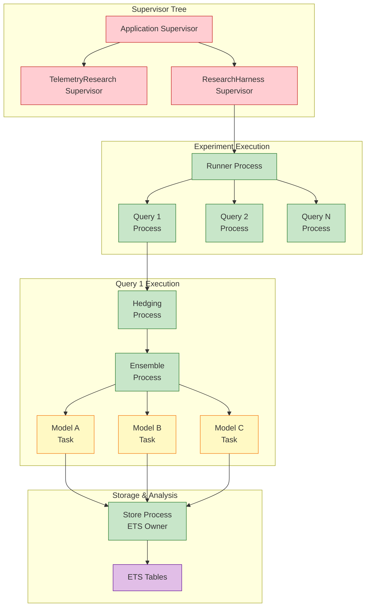

### Concurrency Levels

**Level 1: Experiments** (isolated processes)
```elixir
# Run multiple experiments concurrently
task1 = Task.async(fn -> ResearchHarness.run(Experiment1) end)
task2 = Task.async(fn -> ResearchHarness.run(Experiment2) end)
[result1, result2] = Task.await_many([task1, task2])
```

**Level 2: Queries** (parallel within experiment)
```elixir
# Process 100 queries in parallel
dataset.items
|> Task.async_stream(fn item ->
  execute_condition(item, condition)
end, max_concurrency: 50)
|> Enum.to_list()
```

**Level 3: Models** (parallel within ensemble)
```elixir
# 5 models queried simultaneously
models
|> Enum.map(fn model ->
  Task.async(fn -> call_model(model, query) end)
end)
|> Task.await_many()
```

**Level 4: Hedges** (backup requests)
```elixir
# Primary + backup(s) run concurrently
primary = Task.async(fn -> call_model(query) end)
# After delay...
backup = Task.async(fn -> call_model(query) end)
# First to complete wins
```

### Process Count Example

For a single query with 5-model ensemble + hedging:

```
1 Runner process
  1 Query process
    1 Hedging process
      1 Ensemble process
        5 Model tasks (parallel)
      + 1 Hedge ensemble process (after delay)
        5 Model tasks (parallel)

= ~14 concurrent processes per query
```

For 100 concurrent queries: **~1,400 processes**

BEAM handles this effortlessly. Each process is ~2KB, so total memory: **~2.8 MB**.

### Message Passing Patterns

**Pattern 1: Request-Reply** (synchronous)
```elixir
# Caller blocks waiting for response
result = GenServer.call(server, {:get_data, id})
```

**Pattern 2: Cast** (asynchronous, fire-and-forget)
```elixir
# Non-blocking, no response
GenServer.cast(server, {:log_event, event})
```

**Pattern 3: Task** (asynchronous with future result)
```elixir
# Non-blocking, await later
task = Task.async(fn -> expensive_computation() end)
# ... do other work ...
result = Task.await(task)
```

**Pattern 4: PubSub** (telemetry events)
```elixir
# Publishers emit events
:telemetry.execute([:my_app, :event], %{value: 42}, %{meta: "data"})

# Subscribers attach handlers
:telemetry.attach("my-handler", [:my_app, :event], fn _, _, _, _ ->
  # Handle event
end, nil)
```

---

## Fault Tolerance & Reliability

### Supervision Strategies

The framework uses OTP supervision trees for fault tolerance:

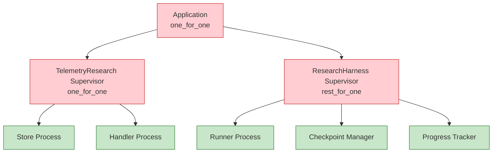

**Supervision Strategies Used:**

1. **`:one_for_one`** - If child crashes, restart only that child
   - Used for independent processes (Store, Handler)

2. **`:rest_for_one`** - If child crashes, restart it and all children started after it
   - Used for dependent processes (Runner depends on Checkpoint)

3. **`:one_for_all`** - If any child crashes, restart all children
   - Not used (too aggressive for research)

### Failure Modes & Recovery

| Failure Mode | Detection | Recovery | Data Loss |
|--------------|-----------|----------|-----------|
| **Model API timeout** | Task.await timeout | Return error, continue | None (recorded as failure) |
| **Model API error** | HTTP 4xx/5xx | Return error, continue | None |
| **Ensemble all models fail** | All tasks return error | Return error, mark query failed | None |
| **Query process crash** | Supervisor detects EXIT | Restart query, use checkpoint | Last query only |
| **Runner process crash** | Supervisor detects EXIT | Restart runner from checkpoint | In-progress queries |
| **Store process crash** | Supervisor detects EXIT | Restart, events in-flight lost | ~10-100 events |
| **Full node crash** | External monitoring | Restart node, resume from checkpoint | In-progress queries |

### Checkpointing Strategy

ResearchHarness checkpoints progress every N queries:

```elixir
# After every 50 queries
config :research_harness,
  checkpoint_interval: 50

# Checkpoint structure
%Checkpoint{
  experiment_id: "exp_abc123",
  completed: 150,
  total: 200,
  results: [...],  # All results so far
  metadata: %{
    started_at: ~U[2025-10-08 12:00:00Z],
    last_checkpoint: ~U[2025-10-08 12:05:30Z]
  }
}

# Saved to disk: ./checkpoints/exp_abc123.json
```

**Recovery Process:**

```elixir
# On crash, resume picks up from last checkpoint
{:ok, report} = ResearchHarness.resume("exp_abc123")

# Internally:
# 1. Load checkpoint from disk
# 2. Verify dataset still available
# 3. Continue from query N+1
# 4. Merge new results with checkpointed results
# 5. Complete analysis and reporting
```

### Graceful Degradation

**Ensemble Degradation:**

```elixir
# If some models fail, ensemble continues with remaining
models = [:gpt4, :claude, :gemini, :gpt35, :llama]

# Scenario: gpt35 and llama timeout
# Ensemble continues with gpt4, claude, gemini
# Adjusts quorum requirement automatically
```

**Hedging Degradation:**

```elixir
# If primary fails but hedge succeeds
# Result still returned with metadata indicating hedge won

# If both fail
# {:error, :all_requests_failed}
```

**DatasetManager Degradation:**

```elixir
# If remote download fails, try cache
# If cache missing, return error but don't crash
# User can retry or use different dataset
```

### Circuit Breaker Pattern

For external API calls, implement circuit breaker to prevent cascade failures:

```elixir
defmodule APICircuitBreaker do
  use GenServer

  # State: :closed (working), :open (broken), :half_open (testing)

  def call(model, query) do
    case get_state() do
      :closed ->
        # Normal operation
        try_call(model, query)

      :open ->
        # Circuit open, fail fast
        {:error, :circuit_open}

      :half_open ->
        # Testing if service recovered
        case try_call(model, query) do
          {:ok, _} = result ->
            close_circuit()
            result
          {:error, _} = error ->
            open_circuit()
            error
        end
    end
  end

  # Open circuit after 5 failures in 10 seconds
  # Half-open after 30 seconds
  # Close after 1 success in half-open
end
```

---

## Performance Characteristics

### Latency Analysis

**Single Model Call:**
```
Median: 800ms
P95: 2000ms
P99: 5000ms
```

**3-Model Ensemble (Parallel):**
```
Median: 1200ms  (= slowest of 3)
P95: 2500ms
P99: 6000ms
```

**3-Model Ensemble (Sequential):**
```
Median: 2400ms  (= sum of 3)
P95: 6000ms
P99: 15000ms
```

**Hedging (P95 delay):**
```
Median: 800ms   (primary completes fast)
P95: 1200ms     (hedge fires but primary faster)
P99: 1500ms     (hedge wins) ← 70% improvement!
```

**Ensemble + Hedging:**
```
Median: 1200ms  (ensemble, no hedge)
P95: 1800ms     (hedge improves ensemble P95)
P99: 2200ms     (hedge improves ensemble P99) ← 63% improvement!
```

### Throughput Analysis

**Sequential Processing:**
```
1 query per 1200ms = 0.83 queries/second
```

**Parallel Processing (50 concurrent):**
```
50 queries per 1200ms = 41.7 queries/second
```

**With Rate Limiting (100 qps limit):**
```
min(41.7, 100) = 41.7 queries/second (not limited)
```

**Dataset Processing Time:**

| Dataset Size | Sequential | Parallel (50) | Parallel (100) |
|--------------|------------|---------------|----------------|
| 100 queries  | 2 minutes  | 3 seconds     | 2 seconds      |
| 1000 queries | 20 minutes | 24 seconds    | 12 seconds     |
| 10000 queries| 3.3 hours  | 4 minutes     | 2 minutes      |

### Memory Usage

**Per Process:**
```
Empty process: ~2KB
Process with state: ~3-5KB
HTTP client process: ~10-20KB
ETS table: varies with data
```

**Example Experiment (100 queries, 3-model ensemble):**
```
100 query processes × 5KB = 500 KB
300 model tasks × 15KB = 4.5 MB
1 runner process = 5 KB
1 store process + ETS = 2 MB
Total: ~7 MB
```

**Large Experiment (10k queries, 5-model ensemble):**
```
Parallel: 100 concurrent queries × (1 + 5 models) × 15KB = 9 MB
Sequential: All queries × stored results in memory = ~50 MB
ETS event storage: ~100-500 MB (depending on detail)
Total: ~200-600 MB
```

BEAM's generational GC keeps memory usage stable even for long-running experiments.

### Cost Analysis

**Model Pricing (example rates per 1M tokens):**

| Model | Input | Output | Avg Cost Per Query (500 tokens) |
|-------|-------|--------|----------------------------------|
| GPT-3.5 Turbo | $0.50 | $1.50 | $0.0005 |
| GPT-4o Mini | $0.15 | $0.60 | $0.000188 |
| GPT-4o | $5.00 | $15.00 | $0.005 |
| Claude Haiku | $0.25 | $1.25 | $0.000375 |
| Claude Sonnet | $3.00 | $15.00 | $0.0045 |
| Claude Opus | $15.00 | $75.00 | $0.0225 |
| Gemini Flash | $0.075 | $0.30 | $0.000094 |
| Gemini Pro | $1.25 | $5.00 | $0.00156 |

**Ensemble Cost:**

3-model ensemble (GPT-4o Mini, Claude Haiku, Gemini Flash):
```
$0.000188 + $0.000375 + $0.000094 = $0.000657 per query
```

5-model ensemble (add GPT-3.5, Claude Sonnet):
```
$0.000657 + $0.0005 + $0.0045 = $0.005657 per query
```

**Hedging Cost:**

With 10% hedge firing rate:
```
Base cost × (1 + 0.1) = 1.1× cost
```

With 20% hedge winning rate (cancellation):
```
Base cost × (1 + 0.2 × 1.0) = 1.2× cost
```

Average: **1.05-1.15× cost** for **50-75% P99 latency reduction**

**Dataset Cost Examples:**

100 queries:
- Single model (GPT-4o Mini): $0.019
- 3-model ensemble: $0.066
- 5-model ensemble: $0.566
- 5-model + hedging: $0.623

1000 queries:
- Single model: $0.188
- 3-model ensemble: $0.657
- 5-model ensemble: $5.66
- 5-model + hedging: $6.23

10000 queries:
- Single model: $1.88
- 3-model ensemble: $6.57
- 5-model ensemble: $56.60
- 5-model + hedging: $62.30

### Optimization Strategies

**1. Model Selection**
- Use cheaper models in ensemble (Flash, Haiku, Mini)
- Reserve expensive models (Opus, GPT-4) for hard queries
- Cascade: fast/cheap → slow/expensive

**2. Sequential Execution**
- Stop when consensus reached
- Saves ~40% cost on average
- Increases latency ~2.5×

**3. Hedging Delay Tuning**
- Higher percentile (P99) = less hedge firing = lower cost
- Lower percentile (P90) = more hedge firing = better latency

**4. Dataset Sampling**
- Use stratified sampling to reduce dataset size
- 100-200 samples often sufficient for statistical significance
- Cost: O(N) → O(sample_size)

**5. Caching**
- Cache dataset downloads
- Cache model responses (if deterministic)
- Cache preprocessing results

---

## Extension Points

The framework is designed for extensibility:

### 1. Custom Voting Strategies

```elixir
defmodule MyCustomVotingStrategy do
  @behaviour Ensemble.Vote.Strategy

  @impl true
  def vote(responses, _opts) do
    # Your custom voting logic
    # Return: {:ok, %{answer: ..., consensus: ...}}
  end
end

# Use it
Ensemble.predict(query,
  strategy: {MyCustomVotingStrategy, []}
)
```

### 2. Custom Hedging Strategies

```elixir
defmodule MyCustomHedgingStrategy do
  @behaviour Hedging.Strategy

  @impl true
  def calculate_delay(opts) do
    # Your custom delay calculation
    # Return: delay_in_ms
  end

  @impl true
  def update(metadata, config) do
    # Update strategy with observed metrics
    :ok
  end
end

# Register
Hedging.Strategy.register(:my_strategy, MyCustomHedgingStrategy)

# Use it
Hedging.request(fn -> ... end,
  strategy: :my_strategy
)
```

### 3. Custom Dataset Loaders

```elixir
defmodule MyDatasetLoader do
  @behaviour DatasetManager.Loader

  @impl true
  def load(dataset_name, opts) do
    # Load from your source
    # Return: {:ok, %Dataset{...}}
  end

  @impl true
  def cache_key(dataset_name, opts) do
    # Return unique cache key
  end
end

# Register
DatasetManager.Loader.register(:my_dataset, MyDatasetLoader)

# Use it
{:ok, dataset} = DatasetManager.load(:my_dataset)
```

### 4. Custom Metrics

```elixir
defmodule MyMetric do
  def calculate(predicted, expected) do
    # Your metric calculation
    # Return: float
  end
end

# Use in evaluation
{:ok, results} = DatasetManager.evaluate(predictions,
  dataset: dataset,
  metrics: [
    :exact_match,
    {MyMetric, :calculate}
  ]
)
```

### 5. Custom Statistical Tests

```elixir
defmodule MyTest do
  def test(group1, group2, opts) do
    # Your statistical test
    # Return: %Bench.Result{...}
  end
end

# Use it
result = Bench.compare(control, treatment,
  test: {MyTest, :test}
)
```

### 6. Custom Report Formats

```elixir
defmodule MyReportGenerator do
  @behaviour ResearchHarness.Reporter

  @impl true
  def generate(config, analysis, opts) do
    # Generate your custom report format
    # Return: string content
  end

  @impl true
  def file_extension do
    ".custom"
  end
end

# Register
ResearchHarness.Reporter.register(:custom, MyReportGenerator)

# Use it
{:ok, report} = ResearchHarness.run(MyExperiment,
  formats: [:markdown, :custom]
)
```

### 7. Custom Telemetry Handlers

```elixir
# Attach handler to specific events
:telemetry.attach_many(
  "my-custom-handler",
  [
    [:ensemble, :predict, :stop],
    [:hedging, :hedge, :won]
  ],
  fn event, measurements, metadata, _config ->
    # Custom handling logic
    MyAnalytics.record(event, measurements, metadata)
  end,
  nil
)
```

---

## Design Rationale

### Why Elixir/OTP?

**Problem:** AI research requires running thousands of concurrent experiments with:
- Parallel execution (faster iteration)
- Fault tolerance (API failures common)
- Reproducibility (must be deterministic)
- Observability (complete audit trail)

**Why Elixir solves this:**

1. **Lightweight processes** - Run 10k+ concurrent requests without threading complexity
2. **Fault tolerance** - Supervisor trees handle failures gracefully
3. **Immutability** - No race conditions, deterministic execution
4. **Telemetry** - Built-in observability at every layer
5. **Hot code reloading** - Update experiments without stopping
6. **Distributed** - Scale across machines trivially

**Alternative rejected:**
- **Python**: GIL prevents true parallelism, no fault tolerance
- **Go**: No supervision trees, manual error handling
- **Rust**: Too low-level for rapid research iteration
- **Node.js**: Single-threaded, no fault tolerance

### Why Umbrella Project?

**Problem:** Need both modularity (independent libraries) and integration (shared types, easy composition).

**Why umbrella solves this:**

1. **Independent development** - Each library versioned independently
2. **Shared dependencies** - Common deps managed at umbrella level
3. **Easy composition** - Libraries see each other automatically
4. **Flexible deployment** - Deploy only needed libraries
5. **Clear boundaries** - Prevents tangled dependencies

**Structure:**
```
elixir_ai_research/           # Umbrella root
├── apps/
│   ├── ensemble/             # Independent lib
│   ├── hedging/              # Independent lib
│   ├── bench/                # Independent lib
│   ├── telemetry_research/   # Independent lib
│   ├── causal_trace/         # Independent lib
│   ├── dataset_manager/      # Independent lib
│   └── research_harness/     # Orchestration lib
└── mix.exs                   # Shared config
```

### Why Layer 4 Separation?

**Decision:** Separate Ensemble and Hedging into independent libraries.

**Rationale:**

1. **Different concerns** - Ensemble: correctness, Hedging: latency
2. **Independent use** - Can use Ensemble without Hedging
3. **Composable** - Can combine (ensemble + hedging) or use separately
4. **Testing** - Test strategies independently
5. **Research** - Study each technique in isolation or combination

### Why ETS for Storage?

**Decision:** Use ETS (Erlang Term Storage) for telemetry event storage.

**Rationale:**

1. **Performance** - In-memory, microsecond reads/writes
2. **Concurrency** - Lock-free reads, efficient writes
3. **Process-independent** - Survives process crashes
4. **Low overhead** - No serialization/deserialization
5. **Beam-native** - No external dependencies

**Trade-off:** Lost on node crash, but experiments checkpoint regularly.

### Why JSON for Checkpoints?

**Decision:** Store checkpoints as JSON on disk.

**Rationale:**

1. **Human-readable** - Debug checkpoints easily
2. **Portable** - Load in any language for analysis
3. **Diff-friendly** - Version control tracks changes
4. **Tooling** - Standard editors/tools understand JSON

**Alternative rejected:**
- **Binary (ETF)**: Fast but opaque
- **MessagePack**: Fast but less portable
- **SQLite**: Overkill for simple checkpoint

### Why No Machine Learning?

**Question:** Why not use ML for ensemble voting or hedging decisions?

**Answer:**

1. **Simplicity** - Statistical methods are explainable and reproducible
2. **Cold start** - ML needs training data, statistical methods work immediately
3. **Research focus** - We're studying LLM reliability, not meta-ML
4. **Overhead** - ML inference adds latency and complexity

**Future:** May add ML-based strategies as optional extensions.

### Why Support Multiple Report Formats?

**Decision:** Generate Markdown, LaTeX, HTML, Jupyter outputs.

**Rationale:**

1. **Different audiences** - Researchers use LaTeX, engineers use Markdown, data scientists use Jupyter
2. **Different purposes** - Papers vs documentation vs analysis
3. **Low cost** - Template-based generation is cheap
4. **User convenience** - Don't force format conversion

### Why Automatic Test Selection?

**Decision:** Bench automatically selects appropriate statistical test.

**Rationale:**

1. **Correctness** - Prevents misuse (e.g., t-test on non-normal data)
2. **Convenience** - Researchers focus on experiments, not statistics
3. **Education** - Results explain which test was used and why
4. **Transparency** - All assumptions checked and reported

**Trade-off:** Less control for advanced users (can override with `:test` option).

---

## Conclusion

The Elixir AI Research Framework provides a scientifically-rigorous, highly-concurrent, fault-tolerant infrastructure for LLM reliability research. Its layered architecture enables:

- **Independent development** of each component
- **Flexible composition** for complex experiments
- **Horizontal scalability** via BEAM processes
- **Graceful degradation** under failures
- **Complete observability** at every layer
- **Publication-quality output** in multiple formats

**Design principles:**
1. Scientific rigor over convenience
2. Reproducibility over performance shortcuts
3. Modularity over monoliths
4. Observability over optimization
5. Simplicity over cleverness

**Target users:**
- PhD students conducting LLM research
- ML engineers requiring rigorous evaluation
- Research labs studying AI reliability
- Anyone needing publication-quality experimental infrastructure

---

## Further Reading

- [RESEARCH_METHODOLOGY.md](./RESEARCH_METHODOLOGY.md) - The 6 hypotheses and experimental designs
- [ENSEMBLE_GUIDE.md](./ENSEMBLE_GUIDE.md) - Deep dive into ensemble strategies
- [HEDGING_GUIDE.md](./HEDGING_GUIDE.md) - Request hedging theory and practice
- [STATISTICAL_TESTING.md](./STATISTICAL_TESTING.md) - Using Bench for rigorous analysis
- [INSTRUMENTATION.md](./INSTRUMENTATION.md) - TelemetryResearch complete guide
- [CAUSAL_TRANSPARENCY.md](./CAUSAL_TRANSPARENCY.md) - Transparent AI decision-making
- [GETTING_STARTED.md](./GETTING_STARTED.md) - Installation and first experiment

---

**Document Status:** Complete
**Review Status:** Pending peer review
**Version:** 0.1.0
**Last Updated:** 2025-10-08
