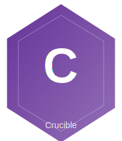

<div align="center"></div>

# CrucibleFramework

**Thin orchestration layer for ML experiment pipelines**

[](https://elixir-lang.org)
[](https://www.erlang.org)
[](https://github.com/North-Shore-AI/crucible_framework/blob/main/LICENSE)

---

## What's New (v0.4.1 - 2025-12-26)

- **Stage Contract**: Enforced `describe/1` policy for all stage implementations
- **Enhanced Documentation**: Comprehensive `Crucible.Stage` behaviour docs with schema specification
- **Runner Documentation**: Clarified that `Crucible.Pipeline.Runner` is the authoritative runner
- **Schema Types**: Defined type specifications for stage option schemas
- **Built-in Stages**: Updated all built-in stages with proper `describe/1` schemas

See [CHANGELOG.md](CHANGELOG.md) for the complete migration guide.

## What's New (v0.4.0 - 2025-12-25)

- **BREAKING**: Simplified to pure orchestration layer (~2,000 LOC from ~5,300 LOC)
- **Removed**: Backend infrastructure (moved to crucible_train)
- **Removed**: Data loading stages (domain-specific)
- **Removed**: Analysis adapters (domain-specific)
- **Removed**: Fairness stages (moved to ExFairness)
- **Removed**: BackendCall stage (moved to crucible_train)
- **Simplified**: Context struct with Phoenix-style `assigns` for domain data
- **Updated**: crucible_ir ~> 0.2.0 with new Training/Deployment/Feedback IR

## Purpose

CrucibleFramework provides:

- **Pipeline Execution** - Sequential stage execution with Context threading
- **Stage Behaviour** - Clean interface for composable pipeline stages
- **Optional Persistence** - Ecto-backed experiment run tracking
- **Telemetry Integration** - Event emission for observability

This library focuses purely on orchestration. Domain-specific functionality belongs in specialized packages:

| Domain | Package |
|--------|---------|
| Training | crucible_train (future) |
| CNS Dialectics | cns_crucible |
| Fairness | ExFairness |
| XAI | crucible_xai |

---

## Quick Start

```elixir
def deps do
  [
    {:crucible_framework, "~> 0.4.1"}
  ]
end
```

### Define and Run an Experiment

```elixir
experiment = %CrucibleIR.Experiment{
  id: "my-experiment",
  backend: %CrucibleIR.BackendRef{id: :my_backend},
  pipeline: [
    %CrucibleIR.StageDef{name: :validate},
    %CrucibleIR.StageDef{name: :data_checks},
    %CrucibleIR.StageDef{name: :bench},
    %CrucibleIR.StageDef{name: :report}
  ]
}

{:ok, ctx} = CrucibleFramework.run(experiment)
```

---

## Core Modules

### Crucible.Context

Runtime context threaded through pipeline stages. Uses Phoenix-style `assigns` for domain-specific data:

```elixir
ctx = %Crucible.Context{
  experiment_id: "exp-1",
  run_id: "run-1",
  experiment: experiment
}

# Add metrics
ctx = Crucible.Context.put_metric(ctx, :accuracy, 0.95)

# Store domain data in assigns (training stages, CNS stages, etc.)
ctx = Crucible.Context.assign(ctx, :dataset, my_data)
ctx = Crucible.Context.assign(ctx, :backend_session, session)
ctx = Crucible.Context.assign(ctx, :snos, extracted_snos)

# Track stage completion
ctx = Crucible.Context.mark_stage_complete(ctx, :data_load)
```

### Context Helper Functions

| Category | Functions |
|----------|-----------|
| Metrics | `put_metric/3`, `get_metric/3`, `update_metric/3`, `merge_metrics/2`, `has_metric?/2` |
| Outputs | `add_output/2`, `add_outputs/2` |
| Artifacts | `put_artifact/3`, `get_artifact/3`, `has_artifact?/2` |
| Assigns | `assign/2`, `assign/3` |
| Stages | `mark_stage_complete/2`, `stage_completed?/2`, `completed_stages/1` |

### Crucible.Stage

Behaviour for pipeline stages:

```elixir
defmodule MyApp.Stage.CustomStage do
  @behaviour Crucible.Stage

  @impl true
  def run(%Crucible.Context{} = ctx, opts) do
    # Do work, update ctx
    {:ok, updated_ctx}
  end

  @impl true
  def describe(opts) do
    %{stage: :custom, description: "My custom stage"}
  end
end
```

### Built-in Stages

| Stage | Purpose |
|-------|---------|
| `Crucible.Stage.Validate` | Pre-flight pipeline validation |
| `Crucible.Stage.DataChecks` | Lightweight data validation (reads from `assigns[:examples]`) |
| `Crucible.Stage.Guardrails` | Safety checks via adapters |
| `Crucible.Stage.Bench` | Statistical analysis (crucible_bench) |
| `Crucible.Stage.Report` | Output generation |

### Crucible.Registry

Stage module resolution from config:

```elixir
# In config.exs
config :crucible_framework,
  stage_registry: %{
    validate: Crucible.Stage.Validate,
    bench: Crucible.Stage.Bench,
    my_stage: MyApp.Stage.Custom
  }
```

---

## Architecture

```
CrucibleFramework.run(experiment)
    |
    v
Crucible.Pipeline.Runner
    |
    +-> Stage 1: Validate
    +-> Stage 2: CustomDataLoader (domain-specific)
    +-> Stage 3: CustomBackendCall (domain-specific)
    +-> Stage 4: Bench
    +-> Stage 5: Report
    |
    v
{:ok, final_context}
```

### Domain-Specific Stages

Training, CNS, and other domain-specific stages should be implemented in their respective packages and registered via config:

```elixir
# crucible_train would provide:
config :crucible_framework,
  stage_registry: %{
    data_load: CrucibleTrain.Stage.DataLoad,
    backend_call: CrucibleTrain.Stage.BackendCall,
    # ...
  }

# cns_crucible would provide:
config :crucible_framework,
  stage_registry: %{
    cns_extract: CnsCrucible.Stage.SNOExtraction,
    cns_topology: CnsCrucible.Stage.TopologyAnalysis,
    # ...
  }
```

---

## Configuration

```elixir
config :crucible_framework,
  ecto_repos: [CrucibleFramework.Repo],
  enable_repo: true,  # Set false to disable persistence
  stage_registry: %{
    validate: Crucible.Stage.Validate,
    data_checks: Crucible.Stage.DataChecks,
    guardrails: Crucible.Stage.Guardrails,
    bench: Crucible.Stage.Bench,
    report: Crucible.Stage.Report
  },
  guardrail_adapter: Crucible.Stage.Guardrails.Noop

config :crucible_framework, CrucibleFramework.Repo,
  database: "crucible_dev",
  username: "crucible_dev",
  password: "crucible_dev_pw",
  hostname: "localhost"
```

---

## Dependencies

- **crucible_ir** - Shared experiment IR structs (v0.2.0+)
- **crucible_bench** - Statistical testing
- **crucible_trace** - Causal reasoning traces

---

## Development

```bash
# Setup
mix deps.get && mix compile

# Tests
mix test

# Quality checks
mix format
mix credo --strict
mix dialyzer
```

---

## Related Repositories

| Repository | Purpose |
|------------|---------|
| [crucible_ir](https://github.com/North-Shore-AI/crucible_ir) | Shared IR structs |
| [crucible_bench](https://github.com/North-Shore-AI/crucible_bench) | Statistical testing |
| [crucible_trace](https://github.com/North-Shore-AI/crucible_trace) | Causal transparency |
| [cns](https://github.com/North-Shore-AI/cns) | CNS dialectical reasoning |
| [cns_crucible](https://github.com/North-Shore-AI/cns_crucible) | CNS + Crucible integration |

---

## License

MIT. See [LICENSE](LICENSE).
