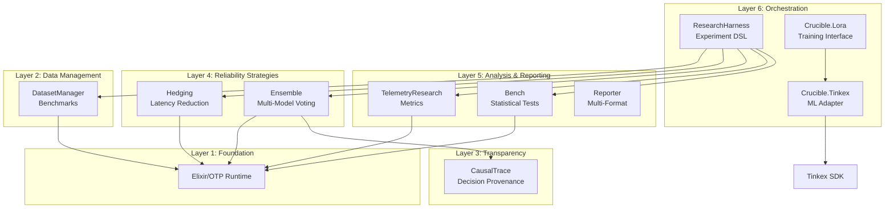

<div align="center"></div>

# CrucibleFramework

**A Scientifically-Rigorous Infrastructure for LLM Reliability and Performance Research**

[](https://elixir-lang.org)
[](https://www.erlang.org)
[](https://hex.pm/packages/crucible_framework)
[](https://hexdocs.pm/crucible_framework)
[](https://github.com/North-Shore-AI/crucible_framework/blob/main/LICENSE)

---

## Overview

The Crucible Framework is a comprehensive infrastructure for conducting **reproducible, statistically-rigorous experiments** on large language model (LLM) reliability, performance optimization, and cost-accuracy trade-offs. Built on Elixir/OTP, it leverages the BEAM virtual machine's strengths in concurrency, fault tolerance, and distributed computing to enable research at scale.

**Target Audience:**
- PhD students and researchers studying LLM reliability
- ML engineers requiring rigorous experimental evaluation
- Research labs investigating AI system optimization
- Anyone needing publication-quality experimental infrastructure

**Key Features:**
- **Multi-model ensemble voting** with 4 voting strategies
- **Request hedging** for tail latency reduction (50-75% P99 improvement)
- **Adapter-agnostic LoRA training interface** (Crucible.Lora + Tinkex adapter)
- **Statistical testing** with 15+ tests (parametric & non-parametric)
- **Research-grade instrumentation** with complete event capture
- **Causal transparency** for LLM decision provenance
- **Automated experiment orchestration** with checkpointing
- **Multi-format reporting** (Markdown, LaTeX, HTML, Jupyter)

---

## Quick Start

### Installation

Add `crucible_framework` to your `mix.exs`:

```elixir
def deps do
  [
    {:crucible_framework, "~> 0.2.1"}
  ]
end
```

Then fetch dependencies:

```bash
mix deps.get
```

### LoRA Training Workflow

```elixir
# 1. Create experiment
{:ok, experiment} = Crucible.Lora.create_experiment(
  name: "SciFact Fine-tuning",
  config: %{
    base_model: "llama-3-8b",
    lora_rank: 16,
    learning_rate: 1.0e-4
  }
)

# 2. Load dataset
{:ok, dataset} = Crucible.Datasets.load(:scifact, split: :train)

# 3. Train with quality targets
{:ok, metrics} = Crucible.Lora.train(experiment, dataset,
  epochs: 5,
  batch_size: 8,
  checkpoint_every: 100,
  quality_targets: %{
    schema_compliance: 0.95,
    citation_accuracy: 0.95
  }
)

# 4. Evaluate results
{:ok, eval} = Crucible.Lora.evaluate(experiment, test_dataset)

# 5. Generate report
{:ok, report} = Crucible.Reporter.generate(eval, format: :markdown)
```

### Ensemble Inference

```elixir
# Create ensemble from multiple adapters
{:ok, ensemble} = Crucible.Ensemble.create(
  adapters: [
    %{name: "scifact-v1", weight: 0.4},
    %{name: "scifact-v2", weight: 0.3},
    %{name: "scifact-v3", weight: 0.3}
  ],
  strategy: :weighted_majority
)

# Run inference with hedging
{:ok, result} = Crucible.Ensemble.infer(ensemble, prompt,
  hedging: :percentile_75,
  timeout: 5000
)
```

---

## Architecture

The framework consists of **6 layers** organized as **8 independent OTP applications**:



**See [ARCHITECTURE.md](./ARCHITECTURE.md) for complete system design.**

---

## Core Libraries

### LoRA Integration Layer

Crucible provides an adapter-agnostic API (`Crucible.Lora`) that funnels telemetry, checkpoints, and quality validation through a common interface. The default adapter (`Crucible.Tinkex`) drives the Tinkex SDK, but you can swap adapters via `config :crucible_framework, :lora_adapter, YourAdapter`.

```elixir
# config/runtime.exs
config :crucible_framework, :lora_adapter, Crucible.Tinkex

config :crucible_framework, Crucible.Tinkex,
  api_key: System.fetch_env!("TINKEX_API_KEY"),
  base_url: "https://api.tinker.example.com",
  timeout: 60_000

{:ok, experiment} =
  Crucible.Lora.create_experiment(
    name: "SciFact Fine-tuning",
    config: %{
      base_model: "llama-3-8b",
      lora_rank: 16,
      learning_rate: 1.0e-4
    }
  )

# Training with automatic telemetry
{:ok, metrics} = Crucible.Lora.train(experiment, dataset,
  epochs: 5,
  batch_size: 8,
  checkpoint_every: 100
)
```

**Adapter Capabilities**
- `Crucible.Lora` - High-level helpers for batching, formatting, metrics, and checkpoints
- `Crucible.Tinkex.Config` - API credentials, retry policies, default LoRA hyperparameters
- `Crucible.Tinkex.Experiment` - Sweep/replication definitions and run generation
- `Crucible.Tinkex.QualityValidator` - CNS3-derived schema/citation/entailment gates
- `Crucible.Tinkex.Results` - Training/eval aggregation with CSV/export helpers
- `Crucible.Tinkex.Telemetry` - Standardized `[:crucible, :tinkex, ...]` events

You can implement additional adapters by satisfying the [`Crucible.Lora.Adapter`](./lib/crucible/lora/adapter.ex) behaviour.

### Ensemble: Multi-Model Voting

Increase reliability by querying multiple models and aggregating responses.

```elixir
{:ok, result} = Ensemble.predict("What is 2+2?",
  models: [:gpt4, :claude, :gemini],
  strategy: :majority,
  execution: :parallel
)

result.answer              # => "4"
result.metadata.consensus  # => 1.0 (100% agreement)
result.metadata.cost_usd   # => 0.045
```

**Voting Strategies:**
- `:majority` - Most common answer wins (default)
- `:weighted` - Weight by confidence scores
- `:best_confidence` - Highest confidence answer
- `:unanimous` - All must agree

**Execution Strategies:**
- `:parallel` - All models simultaneously (fastest)
- `:sequential` - One at a time until consensus (cheapest)
- `:hedged` - Primary with backups (balanced)
- `:cascade` - Fast/cheap to slow/expensive

**Expected Results:**
- **Reliability:** 96-99% accuracy (vs 89-92% single model)
- **Cost:** 3-5x single model cost
- **Latency:** = slowest model in parallel mode

**See [ENSEMBLE_GUIDE.md](./ENSEMBLE_GUIDE.md) for deep dive.**

### Hedging: Tail Latency Reduction

Reduce P99 latency by sending backup requests after a delay.

```elixir
Hedging.request(fn ->
  call_api()
end,
  strategy: :percentile,
  percentile: 95,
  enable_cancellation: true
)
```

**Strategies:**
- `:fixed` - Fixed delay (e.g., 100ms)
- `:percentile` - Delay = Pth percentile latency
- `:adaptive` - Learn optimal delay over time
- `:workload_aware` - Different delays per workload type

**Expected Results:**
- **P99 latency:** 50-75% reduction
- **Cost:** 5-15% increase (hedge fires ~10% of time)
- **Based on:** Google's "Tail at Scale" research

**See [HEDGING_GUIDE.md](./HEDGING_GUIDE.md) for theory and practice.**

### Bench: Statistical Testing

Rigorous statistical analysis for publication-quality results.

```elixir
control = [0.89, 0.87, 0.90, 0.88, 0.91]
treatment = [0.96, 0.97, 0.94, 0.95, 0.98]

result = Bench.compare(control, treatment)
```

**Output:**
```elixir
%Bench.Result{
  test: :welch_t_test,
  p_value: 0.00012,
  effect_size: %{cohens_d: 4.52, interpretation: "very large"},
  confidence_interval: %{interval: {0.051, 0.089}, level: 0.95},
  interpretation: """
  Treatment group shows significantly higher accuracy (M=0.96, SD=0.015)
  compared to control (M=0.89, SD=0.015), t(7.98)=8.45, p<0.001, d=4.52.
  """
}
```

**Features:**
- **15+ statistical tests:** t-tests, ANOVA, Mann-Whitney, Wilcoxon, Kruskal-Wallis
- **Automatic test selection:** Checks assumptions, selects appropriate test
- **Effect sizes:** Cohen's d, eta squared, omega squared, odds ratios
- **Power analysis:** A priori and post-hoc
- **Multiple comparison correction:** Bonferroni, Holm, Benjamini-Hochberg

**See [STATISTICAL_TESTING.md](./STATISTICAL_TESTING.md) for complete guide.**

### TelemetryResearch: Instrumentation

Complete event capture for reproducible research.

```elixir
# Start experiment
{:ok, exp} = TelemetryResearch.start_experiment(
  name: "ensemble_vs_single",
  condition: "treatment",
  tags: ["accuracy", "h1"]
)

# All events automatically captured

# Stop and export
{:ok, exp} = TelemetryResearch.stop_experiment(exp.id)
{:ok, path} = TelemetryResearch.export(exp.id, :csv)
```

**Features:**
- **Experiment isolation:** Multiple concurrent experiments, no cross-contamination
- **Event enrichment:** Automatic metadata (timestamp, experiment context, process info)
- **Storage backends:** ETS (in-memory) or PostgreSQL (persistent)
- **Export formats:** CSV, JSON Lines, Parquet
- **Metrics calculation:** Latency percentiles, cost, reliability

**See [INSTRUMENTATION.md](./INSTRUMENTATION.md) for complete guide.**

### DatasetManager: Benchmark Datasets

Unified interface to standard benchmarks with caching.

```elixir
# Load dataset
{:ok, dataset} = DatasetManager.load(:mmlu_stem, sample_size: 200)

# Evaluate predictions
{:ok, results} = DatasetManager.evaluate(predictions,
  dataset: dataset,
  metrics: [:exact_match, :f1]
)

results.accuracy  # => 0.96
```

**Supported Datasets:**
- **MMLU:** 15,908 questions across 57 subjects
- **HumanEval:** 164 Python programming problems
- **GSM8K:** 8,500 grade school math problems
- **SciFact:** Scientific claim verification
- **FEVER:** Fact extraction and verification
- **Custom:** Load from JSONL files

**Features:**
- **Automatic caching:** First load downloads, subsequent loads from cache
- **Version tracking:** Dataset versions locked for reproducibility
- **Multiple metrics:** Exact match, F1, BLEU, CodeBLEU
- **Sampling:** Random, stratified, k-fold cross-validation

**See [DATASETS.md](./DATASETS.md) for details.**

### CausalTrace: Decision Provenance

Capture and visualize LLM decision-making for transparency.

```elixir
# Parse LLM output with event tags
{:ok, chain} = CausalTrace.parse_llm_output(llm_response, "Task Name")

# Save and visualize
CausalTrace.save(chain)
CausalTrace.open_visualization(chain)
```

**Event Types:**
- Task decomposition, hypothesis formation, pattern application
- Alternative consideration, constraint identification
- Decision making, uncertainty flagging

**See [CAUSAL_TRANSPARENCY.md](./CAUSAL_TRANSPARENCY.md) for details.**

### Security & Adversarial Robustness

Protect your LLM systems from attacks, bias, and data quality issues.

```elixir
# Complete security pipeline
{:ok, result} = SecurePipeline.process(user_input)

# Automatically protects against:
# - 21 adversarial attack types
# - Prompt injection (24+ patterns)
# - Bias and fairness violations
# - Data quality issues and drift
```

**See [ADVERSARIAL_ROBUSTNESS.md](./ADVERSARIAL_ROBUSTNESS.md) for complete technical deep dive.**

---

## Installation & Setup

### Prerequisites

- **Elixir:** 1.14 or higher
- **Erlang/OTP:** 25 or higher
- **PostgreSQL:** 14+ (optional, for persistent telemetry storage)

### Framework Installation

```bash
# Clone repository
git clone https://github.com/North-Shore-AI/crucible_framework.git
cd crucible_framework

# Install dependencies
mix deps.get

# Compile
mix compile

# Run tests
mix test

# Generate documentation
mix docs
```

### Configuration

Create `config/config.exs`:

```elixir
import Config

# Tinkex Configuration
config :crucible_framework, Crucible.Tinkex,
  api_key: System.get_env("TINKEX_API_KEY"),
  base_url: "https://api.tinker.example.com",
  timeout: 60_000,
  pool_size: 10

config :crucible_framework,
  lora_adapter: Crucible.Tinkex,
  telemetry_backend: :ets,
  default_hedging: :percentile_75

# API Keys for ensemble models
config :ensemble,
  openai_api_key: System.get_env("OPENAI_API_KEY"),
  anthropic_api_key: System.get_env("ANTHROPIC_API_KEY"),
  google_api_key: System.get_env("GOOGLE_API_KEY")

# Dataset caching
config :dataset_manager,
  cache_dir: "~/.cache/crucible_framework/datasets"

# Telemetry storage
config :telemetry_research,
  storage_backend: :ets  # or :postgres

# Research harness
config :research_harness,
  checkpoint_dir: "./checkpoints",
  results_dir: "./results"
```

---

## Documentation

- **[ARCHITECTURE.md](./ARCHITECTURE.md)** - Complete system architecture (6-layer stack, library interactions)
- **[GETTING_STARTED.md](./GETTING_STARTED.md)** - Installation, first experiment, troubleshooting
- **[RESEARCH_METHODOLOGY.md](./RESEARCH_METHODOLOGY.md)** - 6 hypotheses, experimental designs, statistical methods
- **[ENSEMBLE_GUIDE.md](./ENSEMBLE_GUIDE.md)** - Deep dive into ensemble library, voting strategies
- **[HEDGING_GUIDE.md](./HEDGING_GUIDE.md)** - Request hedging explained, Google's research
- **[STATISTICAL_TESTING.md](./STATISTICAL_TESTING.md)** - Using Bench for rigorous analysis
- **[ADVERSARIAL_ROBUSTNESS.md](./ADVERSARIAL_ROBUSTNESS.md)** - Complete security stack
- **[INSTRUMENTATION.md](./INSTRUMENTATION.md)** - TelemetryResearch complete guide
- **[DATASETS.md](./DATASETS.md)** - Supported datasets, adding custom datasets
- **[CAUSAL_TRANSPARENCY.md](./CAUSAL_TRANSPARENCY.md)** - Using CausalTrace
- **Tinkex Integration Docs:** [Architecture Overview](./docs/tinkex_integration/00_architecture_overview.md), [Adapter Implementation](./docs/tinkex_integration/01_tinkex_adapter.md), [LoRA Training Interface](./docs/tinkex_integration/02_lora_training_interface.md), [Ensemble & ML Integration](./docs/tinkex_integration/03_ensemble_ml_integration.md), [Build Prompt](./docs/tinkex_integration/BUILD_PROMPT.md)
- **[CONTRIBUTING.md](./CONTRIBUTING.md)** - How to contribute, code standards
- **[PUBLICATIONS.md](./PUBLICATIONS.md)** - How to cite, paper templates
- **[FAQ.md](./FAQ.md)** - Common questions, troubleshooting
- **[CHANGELOG.md](./CHANGELOG.md)** - Version history and migration guides

---

## Citation

If you use this framework in your research, please cite:

```bibtex
@software{crucible_framework2025,
  title = {Crucible Framework: Infrastructure for LLM Reliability Research},
  author = {Research Infrastructure Team},
  year = {2025},
  url = {https://github.com/North-Shore-AI/crucible_framework},
  version = {v0.2.1}
}
```

---

## Contributing

We welcome contributions! Please see [CONTRIBUTING.md](./CONTRIBUTING.md) for:

- Code of conduct
- Development workflow
- Code standards
- Testing requirements
- Pull request process

---

## License

This project is licensed under the MIT License - see the [LICENSE](https://github.com/North-Shore-AI/crucible_framework/blob/main/LICENSE) file for details.

---

## Support

- **Documentation:** https://hexdocs.pm/crucible_framework
- **Issues:** https://github.com/North-Shore-AI/crucible_framework/issues
- **Discussions:** https://github.com/North-Shore-AI/crucible_framework/discussions

---

**Status:** Active development
**Version:** v0.2.1
**Last Updated:** 2025-11-21
**Maintainers:** Research Infrastructure Team

---

Built with care by researchers, for researchers.
