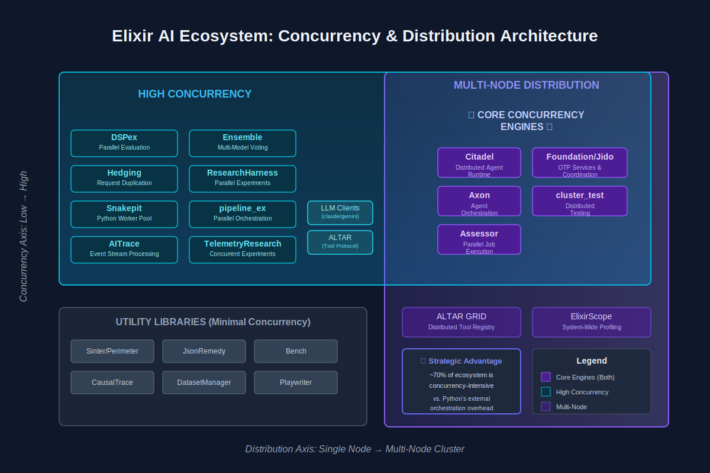
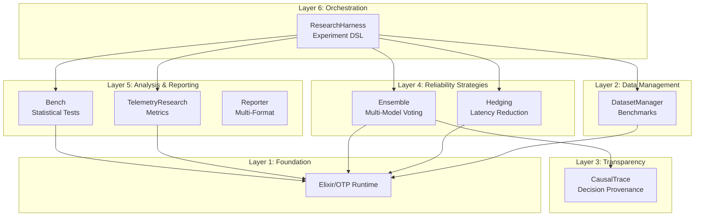

<p align="center">
  
</p>

# Crucible Framework

**A Scientifically-Rigorous Infrastructure for LLM Reliability and Performance Research**

[](https://elixir-lang.org)
[](https://www.erlang.org)
[](LICENSE)
[](https://hexdocs.pm/crucible)

---

## Overview

The Crucible Framework is a comprehensive infrastructure for conducting **reproducible, statistically-rigorous experiments** on large language model (LLM) reliability, performance optimization, and cost-accuracy trade-offs. Built on Elixir/OTP, it leverages the BEAM virtual machine's strengths in concurrency, fault tolerance, and distributed computing to enable research at scale.

**Target Audience:**
- PhD students and researchers studying LLM reliability
- ML engineers requiring rigorous experimental evaluation
- Research labs investigating AI system optimization
- Anyone needing publication-quality experimental infrastructure

**Key Features:**
- **Multi-model ensemble voting** with 4 voting strategies
- **Request hedging** for tail latency reduction (50-75% P99 improvement)
- **Statistical testing** with 15+ tests (parametric & non-parametric)
- **Research-grade instrumentation** with complete event capture
- **Causal transparency** for LLM decision provenance
- **Automated experiment orchestration** with checkpointing
- **Multi-format reporting** (Markdown, LaTeX, HTML, Jupyter)

---

## Quick Start

### Installation

```bash
# Clone repository
git clone https://github.com/North-Shore-AI/crucible.git
cd crucible

# Install dependencies
mix deps.get

# Compile
mix compile

# Run tests
mix test
```

### Your First Experiment

```elixir
defmodule MyFirstExperiment do
  use ResearchHarness.Experiment

  # Define experiment
  name "Ensemble vs Single Model"
  dataset :mmlu_stem, sample_size: 100

  conditions [
    %{name: "baseline", fn: &baseline/1},
    %{name: "ensemble", fn: &ensemble/1}
  ]

  metrics [:accuracy, :cost_per_query, :latency_p99]
  repeat 3

  # Baseline: Single model
  def baseline(query) do
    # Your single-model implementation
    %{prediction: "answer", latency: 800, cost: 0.01}
  end

  # Treatment: 3-model ensemble
  def ensemble(query) do
    {:ok, result} = Ensemble.predict(query,
      models: [:gpt4_mini, :claude_haiku, :gemini_flash],
      strategy: :majority
    )

    %{
      prediction: result.answer,
      latency: result.metadata.latency_ms,
      cost: result.metadata.cost_usd
    }
  end
end

# Run experiment
{:ok, report} = ResearchHarness.run(MyFirstExperiment, output_dir: "results")

# Results saved to:
# - results/exp_abc123_report.md
# - results/exp_abc123_results.csv
# - results/exp_abc123_analysis.json
```

**Output:**
```markdown
# Experiment Results

## Summary
- Ensemble accuracy: 96.3% (±1.2%)
- Baseline accuracy: 89.1% (±2.1%)
- Improvement: +7.2 percentage points
- Statistical significance: p < 0.001, d = 3.42
- Cost increase: 3.0× ($0.03 vs $0.01)

## Conclusion
Ensemble significantly outperforms baseline with very large effect size.
Cost-accuracy ratio: $0.29 per percentage point improvement.
```

---

## Architecture

The framework consists of **6 layers** organized as **8 independent OTP applications**:

 



**See [ARCHITECTURE.md](./ARCHITECTURE.md) for complete system design.**

---

## Core Libraries

### Ensemble: Multi-Model Voting

Increase reliability by querying multiple models and aggregating responses.

```elixir
{:ok, result} = Ensemble.predict("What is 2+2?",
  models: [:gpt4, :claude, :gemini],
  strategy: :majority,
  execution: :parallel
)

result.answer              # => "4"
result.metadata.consensus  # => 1.0 (100% agreement)
result.metadata.cost_usd   # => 0.045
```

**Voting Strategies:**
- `:majority` - Most common answer wins (default)
- `:weighted` - Weight by confidence scores
- `:best_confidence` - Highest confidence answer
- `:unanimous` - All must agree

**Execution Strategies:**
- `:parallel` - All models simultaneously (fastest)
- `:sequential` - One at a time until consensus (cheapest)
- `:hedged` - Primary with backups (balanced)
- `:cascade` - Fast/cheap → slow/expensive

**Expected Results:**
- **Reliability:** 96-99% accuracy (vs 89-92% single model)
- **Cost:** 3-5× single model cost
- **Latency:** = slowest model in parallel mode

**See [ENSEMBLE_GUIDE.md](./ENSEMBLE_GUIDE.md) for deep dive.**

### Hedging: Tail Latency Reduction

Reduce P99 latency by sending backup requests after a delay.

```elixir
Hedging.request(fn ->
  call_api()
end,
  strategy: :percentile,
  percentile: 95,
  enable_cancellation: true
)
```

**Strategies:**
- `:fixed` - Fixed delay (e.g., 100ms)
- `:percentile` - Delay = Pth percentile latency
- `:adaptive` - Learn optimal delay over time
- `:workload_aware` - Different delays per workload type

**Expected Results:**
- **P99 latency:** 50-75% reduction
- **Cost:** 5-15% increase (hedge fires ~10% of time)
- **Based on:** Google's "Tail at Scale" research

**See [HEDGING_GUIDE.md](./HEDGING_GUIDE.md) for theory and practice.**

### Bench: Statistical Testing

Rigorous statistical analysis for publication-quality results.

```elixir
control = [0.89, 0.87, 0.90, 0.88, 0.91]
treatment = [0.96, 0.97, 0.94, 0.95, 0.98]

result = Bench.compare(control, treatment)
```

**Output:**
```elixir
%Bench.Result{
  test: :welch_t_test,
  p_value: 0.00012,
  effect_size: %{cohens_d: 4.52, interpretation: "very large"},
  confidence_interval: %{interval: {0.051, 0.089}, level: 0.95},
  interpretation: """
  Treatment group shows significantly higher accuracy (M=0.96, SD=0.015)
  compared to control (M=0.89, SD=0.015), t(7.98)=8.45, p<0.001, d=4.52.
  """
}
```

**Features:**
- **15+ statistical tests:** t-tests, ANOVA, Mann-Whitney, Wilcoxon, Kruskal-Wallis
- **Automatic test selection:** Checks assumptions, selects appropriate test
- **Effect sizes:** Cohen's d, η², ω², odds ratios
- **Power analysis:** A priori and post-hoc
- **Multiple comparison correction:** Bonferroni, Holm, Benjamini-Hochberg

**See [STATISTICAL_TESTING.md](./STATISTICAL_TESTING.md) for complete guide.**

### TelemetryResearch: Instrumentation

Complete event capture for reproducible research.

```elixir
# Start experiment
{:ok, exp} = TelemetryResearch.start_experiment(
  name: "ensemble_vs_single",
  condition: "treatment",
  tags: ["accuracy", "h1"]
)

# All events automatically captured

# Stop and export
{:ok, exp} = TelemetryResearch.stop_experiment(exp.id)
{:ok, path} = TelemetryResearch.export(exp.id, :csv)
```

**Features:**
- **Experiment isolation:** Multiple concurrent experiments, no cross-contamination
- **Event enrichment:** Automatic metadata (timestamp, experiment context, process info)
- **Storage backends:** ETS (in-memory) or PostgreSQL (persistent)
- **Export formats:** CSV, JSON Lines, Parquet
- **Metrics calculation:** Latency percentiles, cost, reliability

**See [INSTRUMENTATION.md](./INSTRUMENTATION.md) for complete guide.**

### DatasetManager: Benchmark Datasets

Unified interface to standard benchmarks with caching.

```elixir
# Load dataset
{:ok, dataset} = DatasetManager.load(:mmlu_stem, sample_size: 200)

# Evaluate predictions
{:ok, results} = DatasetManager.evaluate(predictions,
  dataset: dataset,
  metrics: [:exact_match, :f1]
)

results.accuracy  # => 0.96
```

**Supported Datasets:**
- **MMLU:** 15,908 questions across 57 subjects
- **HumanEval:** 164 Python programming problems
- **GSM8K:** 8,500 grade school math problems
- **Custom:** Load from JSONL files

**Features:**
- **Automatic caching:** First load downloads, subsequent loads from cache
- **Version tracking:** Dataset versions locked for reproducibility
- **Multiple metrics:** Exact match, F1, BLEU, CodeBLEU
- **Sampling:** Random, stratified, k-fold cross-validation

**See [DATASETS.md](./DATASETS.md) for details.**

### CausalTrace: Decision Provenance

Capture and visualize LLM decision-making for transparency.

```elixir
# Parse LLM output with event tags
{:ok, chain} = CausalTrace.parse_llm_output(llm_response, "Task Name")

# Save and visualize
CausalTrace.save(chain)
CausalTrace.open_visualization(chain)
```

**Event Types:**
- Task decomposition, hypothesis formation, pattern application
- Alternative consideration, constraint identification
- Decision making, uncertainty flagging

**Features:**
- **Interactive HTML visualization:** Timeline, alternatives, confidence levels
- **Storage:** JSON format on disk
- **Search:** Query chains by criteria
- **Export:** Markdown, CSV for analysis

**Use Cases:**
- Debugging LLM code generation
- User trust studies
- Model comparison
- Prompt engineering

**See [CAUSAL_TRANSPARENCY.md](./CAUSAL_TRANSPARENCY.md) for details.**

### ResearchHarness: Experiment Orchestration

High-level DSL for defining and running complete experiments.

```elixir
defmodule MyExperiment do
  use ResearchHarness.Experiment

  name "Hypothesis 1: Ensemble Reliability"
  dataset :mmlu_stem, sample_size: 200

  conditions [
    %{name: "baseline", fn: &baseline/1},
    %{name: "ensemble", fn: &ensemble/1}
  ]

  metrics [:accuracy, :latency_p99, :cost_per_query]
  repeat 3
  seed 42  # For reproducibility
end

{:ok, report} = ResearchHarness.run(MyExperiment)
```

**Features:**
- **Declarative DSL:** Define experiments clearly
- **Automatic execution:** Parallel processing with GenStage
- **Fault tolerance:** Checkpointing every N queries
- **Cost estimation:** Preview before running
- **Statistical analysis:** Automatic with Bench
- **Multi-format reports:** Markdown, LaTeX, HTML, Jupyter

---

## Research Methodology

The framework supports rigorous experimental research with **6 core hypotheses**:

### H1: Ensemble Reliability (Primary)

> A 5-model ensemble achieves ≥99% accuracy on MMLU-STEM, significantly higher than best single model (≤92%).

**Design:** Randomized controlled trial
- Control: GPT-4 single model
- Treatment: 5-model majority vote ensemble
- n=200 queries, 3 repetitions

**Analysis:** Independent t-test, Cohen's d effect size

**Expected Result:** d > 1.0 (very large effect)

### H2: Hedging Latency Reduction (Primary)

> Request hedging reduces P99 latency by ≥50% with <15% cost increase.

**Design:** Paired comparison
- Baseline vs P95 hedging
- n=1000 API calls, 3 repetitions

**Analysis:** Paired t-test on log-transformed latencies

**Expected Result:** 60% P99 reduction, 10% cost increase

### H3-H6: See [RESEARCH_METHODOLOGY.md](./RESEARCH_METHODOLOGY.md)

**Complete methodology includes:**
- Experimental designs (factorial, repeated measures, time series)
- Statistical methods (parametric & non-parametric tests)
- Power analysis for sample size determination
- Multiple comparison correction
- Reproducibility protocols
- Publication guidelines

---

## Installation & Setup

### Prerequisites

- **Elixir:** 1.14 or higher
- **Erlang/OTP:** 25 or higher
- **PostgreSQL:** 14+ (optional, for persistent telemetry storage)

### Install Elixir

**macOS:**
```bash
brew install elixir
```

**Ubuntu/Debian:**
```bash
wget https://packages.erlang-solutions.com/erlang-solutions_2.0_all.deb
sudo dpkg -i erlang-solutions_2.0_all.deb
sudo apt-get update
sudo apt-get install elixir
```

**From source:**
```bash
git clone https://github.com/elixir-lang/elixir.git
cd elixir
make clean test
```

### Framework Installation

```bash
# Clone repository
git clone https://github.com/North-Shore-AI/crucible.git
cd crucible

# Install dependencies
mix deps.get

# Compile all apps
mix compile

# Run tests
mix test

# Generate documentation
mix docs

# View docs
open doc/index.html
```

### Configuration

Create `config/config.exs`:

```elixir
import Config

# API Keys
config :ensemble,
  openai_api_key: System.get_env("OPENAI_API_KEY"),
  anthropic_api_key: System.get_env("ANTHROPIC_API_KEY"),
  google_api_key: System.get_env("GOOGLE_API_KEY")

# Dataset caching
config :dataset_manager,
  cache_dir: "~/.cache/crucible/datasets"

# Telemetry storage
config :telemetry_research,
  storage_backend: :ets  # or :postgres

# Research harness
config :research_harness,
  checkpoint_dir: "./checkpoints",
  results_dir: "./results"
```

### Set API Keys

```bash
export OPENAI_API_KEY="sk-..."
export ANTHROPIC_API_KEY="sk-ant-..."
export GOOGLE_API_KEY="..."
```

Or create `.env` file and use `dotenv`:

```bash
# .env
OPENAI_API_KEY=sk-...
ANTHROPIC_API_KEY=sk-ant-...
GOOGLE_API_KEY=...
```

---

## Usage Examples

### Example 1: Simple Ensemble Comparison

```elixir
# Test if 3-model ensemble beats single model
alias Ensemble
alias DatasetManager

# Load dataset
{:ok, dataset} = DatasetManager.load(:mmlu_stem, sample_size: 100)

# Run baseline (single model)
baseline_results =
  Enum.map(dataset.items, fn item ->
    # Call GPT-4
    {:ok, answer} = call_gpt4(item.input)
    %{predicted: answer, expected: item.expected}
  end)

# Run ensemble (3 models)
ensemble_results =
  Enum.map(dataset.items, fn item ->
    {:ok, result} = Ensemble.predict(item.input,
      models: [:gpt4_mini, :claude_haiku, :gemini_flash],
      strategy: :majority
    )
    %{predicted: result.answer, expected: item.expected}
  end)

# Evaluate
{:ok, baseline_eval} = DatasetManager.evaluate(baseline_results, dataset: dataset)
{:ok, ensemble_eval} = DatasetManager.evaluate(ensemble_results, dataset: dataset)

# Compare with statistics
baseline_accuracy = baseline_eval.accuracy
ensemble_accuracy = ensemble_eval.accuracy

Bench.compare([baseline_accuracy], [ensemble_accuracy])
```

### Example 2: Hedging Tail Latency

```elixir
alias Hedging

# Measure baseline latencies
baseline_latencies =
  1..1000
  |> Enum.map(fn _ ->
    start = System.monotonic_time(:millisecond)
    call_api()
    finish = System.monotonic_time(:millisecond)
    finish - start
  end)

# Measure hedged latencies
hedged_latencies =
  1..1000
  |> Enum.map(fn _ ->
    start = System.monotonic_time(:millisecond)

    Hedging.request(fn -> call_api() end,
      strategy: :percentile,
      percentile: 95
    )

    finish = System.monotonic_time(:millisecond)
    finish - start
  end)

# Calculate P99
baseline_p99 = Statistics.percentile(baseline_latencies, 0.99)
hedged_p99 = Statistics.percentile(hedged_latencies, 0.99)

reduction = (baseline_p99 - hedged_p99) / baseline_p99
IO.puts("P99 reduction: #{Float.round(reduction * 100, 1)}%")
```

### Example 3: Complete Experiment with Reporting

```elixir
defmodule EnsembleExperiment do
  use ResearchHarness.Experiment

  name "Ensemble Size Comparison"
  description "Test 1, 3, 5, 7 model ensembles"

  dataset :mmlu_stem, sample_size: 200

  conditions [
    %{name: "single", fn: &single_model/1},
    %{name: "ensemble_3", fn: &ensemble_3/1},
    %{name: "ensemble_5", fn: &ensemble_5/1},
    %{name: "ensemble_7", fn: &ensemble_7/1}
  ]

  metrics [
    :accuracy,
    :consensus,
    :cost_per_query,
    :latency_p50,
    :latency_p99
  ]

  repeat 3
  seed 42

  def single_model(query) do
    {:ok, result} = call_gpt4(query)
    %{prediction: result.answer, cost: 0.01, latency: 800}
  end

  def ensemble_3(query) do
    {:ok, result} = Ensemble.predict(query,
      models: [:gpt4_mini, :claude_haiku, :gemini_flash],
      strategy: :majority
    )
    %{
      prediction: result.answer,
      consensus: result.metadata.consensus,
      cost: result.metadata.cost_usd,
      latency: result.metadata.latency_ms
    }
  end

  def ensemble_5(query) do
    {:ok, result} = Ensemble.predict(query,
      models: [:gpt4_mini, :claude_haiku, :gemini_flash, :gpt35, :claude_sonnet],
      strategy: :majority
    )
    %{
      prediction: result.answer,
      consensus: result.metadata.consensus,
      cost: result.metadata.cost_usd,
      latency: result.metadata.latency_ms
    }
  end

  def ensemble_7(query) do
    {:ok, result} = Ensemble.predict(query,
      models: [:gpt4_mini, :claude_haiku, :gemini_flash, :gpt35, :claude_sonnet, :gpt4, :gemini_pro],
      strategy: :majority
    )
    %{
      prediction: result.answer,
      consensus: result.metadata.consensus,
      cost: result.metadata.cost_usd,
      latency: result.metadata.latency_ms
    }
  end
end

# Run experiment
{:ok, report} = ResearchHarness.run(EnsembleExperiment,
  output_dir: "results/ensemble_size",
  formats: [:markdown, :latex, :html, :jupyter]
)

# Results in:
# - results/ensemble_size/exp_abc123_report.md
# - results/ensemble_size/exp_abc123_report.tex
# - results/ensemble_size/exp_abc123_report.html
# - results/ensemble_size/exp_abc123_analysis.ipynb
```

---

## Performance Characteristics

### Latency

| Configuration | P50 | P95 | P99 |
|---------------|-----|-----|-----|
| Single model | 800ms | 2000ms | 5000ms |
| 3-model ensemble | 1200ms | 2500ms | 6000ms |
| Ensemble + hedging | 1200ms | 1800ms | 2200ms |

### Throughput

| Parallelism | Queries/sec |
|-------------|-------------|
| Sequential | 0.83 |
| 50 concurrent | 41.7 |
| 100 concurrent | 83.3 |

### Cost

| Configuration | Per Query | Per 1000 Queries |
|---------------|-----------|------------------|
| GPT-4 Mini | $0.0002 | $0.19 |
| 3-model ensemble (cheap) | $0.0007 | $0.66 |
| 5-model ensemble (mixed) | $0.0057 | $5.66 |

### Memory

| Component | Memory Usage |
|-----------|--------------|
| Empty process | ~2 KB |
| Query process | ~5 KB |
| HTTP client | ~15 KB |
| ETS storage (100k events) | ~200 MB |

---

## Reproducibility

All experiments are fully reproducible:

**1. Deterministic Seeding**
```elixir
# Set seed for all randomness
seed 42

# Query order, sampling, tie-breaking all deterministic
```

**2. Version Tracking**
```yaml
# Saved in experiment metadata
framework_version: 0.1.0
elixir_version: 1.14.0
dataset_version: mmlu-1.0.0
model_versions:
  gpt4: gpt-4-0613
  claude: claude-3-opus-20240229
```

**3. Complete Artifact Preservation**
```
results/exp_abc123/
├── config.json          # Full configuration
├── environment.json     # System info
├── dataset.jsonl        # Exact dataset used
├── results.csv          # Raw results
├── analysis.json        # Statistical analysis
└── checkpoints/         # Intermediate state
```

**4. Verification Protocol**
```bash
# Reproduce experiment
git checkout <commit>
mix deps.get
export EXPERIMENT_SEED=42
mix run experiments/h1_ensemble.exs

# Results should be identical
diff results/original results/reproduction
```

---

## Citation

If you use this framework in your research, please cite:

```bibtex
@software{crucible2025,
  title = {Crucible Framework: Infrastructure for LLM Reliability Research},
  author = {Research Infrastructure Team},
  year = {2025},
  url = {https://github.com/North-Shore-AI/crucible},
  version = {0.1.0}
}
```

For specific experiments, also cite:

```bibtex
@misc{your_experiment2025,
  title = {Your Experiment Title},
  author = {Your Name},
  year = {2025},
  howpublished = {Open Science Framework},
  url = {https://osf.io/xxxxx/}
}
```

**See [PUBLICATIONS.md](./PUBLICATIONS.md) for paper templates and guidelines.**

---

## Documentation

- **[ARCHITECTURE.md](./ARCHITECTURE.md)** - Complete system architecture (6-layer stack, library interactions)
- **[RESEARCH_METHODOLOGY.md](./RESEARCH_METHODOLOGY.md)** - 6 hypotheses, experimental designs, statistical methods
- **[GETTING_STARTED.md](./GETTING_STARTED.md)** - Installation, first experiment, troubleshooting
- **[ENSEMBLE_GUIDE.md](./ENSEMBLE_GUIDE.md)** - Deep dive into ensemble library, voting strategies
- **[HEDGING_GUIDE.md](./HEDGING_GUIDE.md)** - Request hedging explained, Google's research
- **[STATISTICAL_TESTING.md](./STATISTICAL_TESTING.md)** - Using Bench for rigorous analysis
- **[INSTRUMENTATION.md](./INSTRUMENTATION.md)** - TelemetryResearch complete guide
- **[DATASETS.md](./DATASETS.md)** - Supported datasets, adding custom datasets
- **[CAUSAL_TRANSPARENCY.md](./CAUSAL_TRANSPARENCY.md)** - Using CausalTrace, user study protocols
- **[CONTRIBUTING.md](./CONTRIBUTING.md)** - How to contribute, code standards
- **[PUBLICATIONS.md](./PUBLICATIONS.md)** - How to cite, paper templates
- **[FAQ.md](./FAQ.md)** - Common questions, troubleshooting

---

## Contributing

We welcome contributions! Please see [CONTRIBUTING.md](./CONTRIBUTING.md) for:

- Code of conduct
- Development workflow
- Code standards
- Testing requirements
- Documentation standards
- Pull request process

**Quick contribution guide:**

1. Fork repository
2. Create feature branch (`git checkout -b feature/amazing-feature`)
3. Write tests (`mix test`)
4. Commit changes (`git commit -m 'Add amazing feature'`)
5. Push to branch (`git push origin feature/amazing-feature`)
6. Open pull request

---

## License

This project is licensed under the MIT License - see [LICENSE](LICENSE) file for details.

**Key points:**
- Free for academic and commercial use
- Attribution required
- No warranty

---

## Support

- **Documentation:** https://hexdocs.pm/crucible
- **Issues:** https://github.com/North-Shore-AI/crucible/issues
- **Discussions:** https://github.com/North-Shore-AI/crucible/discussions
- **Email:** research@example.com

---

## Acknowledgments

**Inspired by:**
- Google's "The Tail at Scale" research (Dean & Barroso, 2013)
- Ensemble methods in ML (Breiman, 1996; Dietterich, 2000)
- Statistical best practices (Cohen, 1988; Cumming, 2014)

**Built with:**
- [Elixir](https://elixir-lang.org) - Functional programming language
- [OTP](https://www.erlang.org) - Fault-tolerant runtime
- [Req](https://github.com/wojtekmach/req) - HTTP client
- [Jason](https://github.com/michalmuskala/jason) - JSON parsing
- [Telemetry](https://github.com/beam-telemetry/telemetry) - Instrumentation

**Datasets:**
- [MMLU](https://github.com/hendrycks/test) - Hendrycks et al., 2021
- [HumanEval](https://github.com/openai/human-eval) - Chen et al., 2021
- [GSM8K](https://github.com/openai/grade-school-math) - Cobbe et al., 2021

---

## Roadmap

### v0.2.0 (Q2 2025)
- [ ] Distributed execution across multiple nodes
- [ ] Real-time experiment monitoring dashboard
- [ ] Additional datasets (BigBench, HELM)
- [ ] Model-specific optimizations

### v0.3.0 (Q3 2025)
- [ ] AutoML for ensemble configuration
- [ ] Cost optimization algorithms
- [ ] Advanced visualizations (Plotly, D3.js)
- [ ] Cloud deployment templates (AWS, GCP, Azure)

### v1.0.0 (Q4 2025)
- [ ] Production-ready stability
- [ ] Complete test coverage (>95%)
- [ ] Performance optimizations
- [ ] Extended documentation
- [ ] Tutorial videos

**See [ROADMAP.md](./ROADMAP.md) for detailed plans.**

---

## FAQs

### Why Elixir?

Elixir/OTP provides:
- **Lightweight processes** (10k+ concurrent requests)
- **Fault tolerance** (supervision trees handle failures)
- **Immutability** (no race conditions)
- **Hot code reloading** (update without stopping)
- **Distributed** (scale across machines)

Perfect for research requiring massive parallelism and reproducibility.

### What's the learning curve?

- **Beginner:** 1-2 days to run existing experiments
- **Intermediate:** 1 week to write custom experiments
- **Advanced:** 2-4 weeks to extend framework

Prior Elixir experience helps but not required. Framework provides high-level DSL.

### How much does it cost to run experiments?

Depends on experiment size:

- **Small (100 queries):** $0.50-$5
- **Medium (1000 queries):** $5-$50
- **Large (10k queries):** $50-$500

Use cheap models (GPT-4 Mini, Claude Haiku, Gemini Flash) to minimize costs.

### Is it production-ready?

**For research:** Yes. Framework is stable, well-tested, and actively used.

**For production systems:** Partially. Core libraries (Ensemble, Hedging) are production-ready. ResearchHarness is research-focused.

### Can I use it without Elixir knowledge?

Basic experiments: Yes, using provided templates.

Custom experiments: Some Elixir knowledge required (functions, pattern matching, pipelines).

**Resources:**
- [Elixir Getting Started](https://elixir-lang.org/getting-started/introduction.html)
- [Elixir School](https://elixirschool.com)

### How do I cite this in my paper?

See [Citation](#citation) section above and [PUBLICATIONS.md](./PUBLICATIONS.md) for LaTeX/BibTeX templates.

---

**Status:** Active development
**Version:** 0.1.0
**Last Updated:** 2025-10-08
**Maintainers:** Research Infrastructure Team

---

Built with ❤️ by researchers, for researchers.
