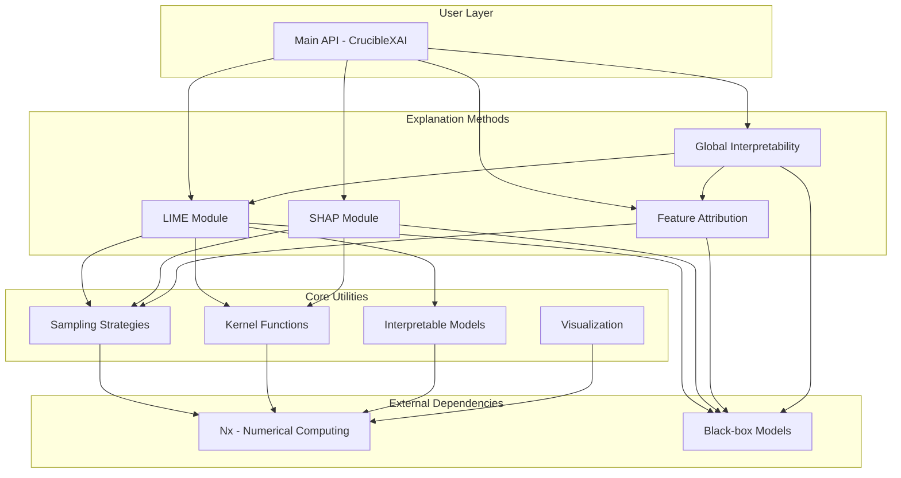
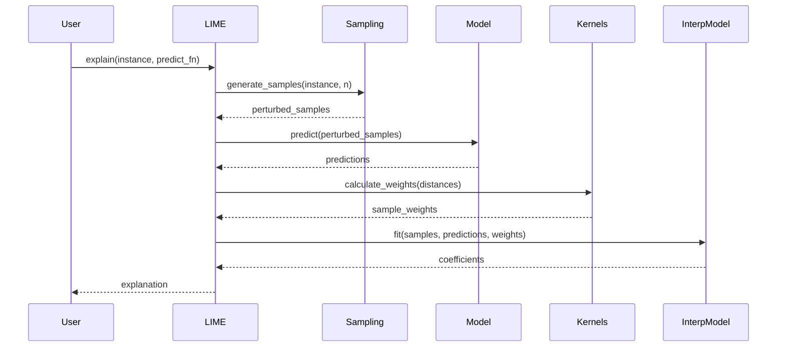

# CrucibleXAI Framework Implementation Buildout

**Date**: October 20, 2025
**Project**: North Shore AI - Crucible Framework
**Component**: CrucibleXAI - Explainable AI (XAI) Library
**Version**: 0.1.0
**Repository**: https://github.com/North-Shore-AI/crucible_xai

---

## Executive Summary

This document provides a comprehensive implementation guide for CrucibleXAI, an Explainable AI (XAI) library for Elixir. CrucibleXAI implements LIME (Local Interpretable Model-agnostic Explanations), SHAP-like explanations, feature attribution methods, and model interpretability tools. The library is built on Nx for high-performance numerical computations and integrates seamlessly with the Crucible AI research infrastructure.

**Key Requirements**:
- Test-Driven Development (TDD) with Red-Green-Refactor cycle
- Zero compiler warnings
- Zero Dialyzer errors
- All tests must pass
- Comprehensive documentation with examples
- Integration with CrucibleTrace for combined explanations

---

## Table of Contents

1. [Project Context](#project-context)
2. [Architecture Overview](#architecture-overview)
3. [LIME Implementation Specification](#lime-implementation-specification)
4. [SHAP Implementation Specification](#shap-implementation-specification)
5. [Feature Attribution Methods](#feature-attribution-methods)
6. [Module Structure and File Organization](#module-structure-and-file-organization)
7. [CrucibleTrace Integration](#crucibletrace-integration)
8. [Test-Driven Development Requirements](#test-driven-development-requirements)
9. [Quality Gates](#quality-gates)
10. [Visualization Requirements](#visualization-requirements)
11. [Implementation Roadmap](#implementation-roadmap)
12. [Success Criteria](#success-criteria)

---

## Project Context

### Background

CrucibleXAI addresses the critical need for model interpretability in AI systems. As machine learning models become more complex, understanding why a model makes specific predictions is essential for:

- **Trust and Validation**: Ensuring models behave as expected
- **Debugging**: Identifying issues in model behavior
- **Fairness Analysis**: Detecting biases across demographic groups
- **Regulatory Compliance**: Meeting explainability requirements
- **Model Comparison**: Understanding differences between models

### Design Principles

1. **Model-Agnostic**: Works with any black-box model via prediction functions
2. **Faithful Explanations**: Locally faithful interpretable models
3. **Human-Interpretable**: Explanations designed for human understanding
4. **Flexible**: Supports various explanation types and customization
5. **Efficient**: Optimized implementations using Nx tensors
6. **Testable**: Comprehensive test coverage with property-based testing

### Dependencies

From `mix.exs`:

```elixir
defp deps do
  [
    {:nx, "~> 0.7"},
    {:ex_doc, "~> 0.31", only: :dev, runtime: false}
  ]
end
```

**Additional Dependencies to Consider**:
- `{:scholar, "~> 0.3"}` - For additional ML utilities
- `{:vega_lite, "~> 0.1"}` - For visualization (optional)
- `{:jason, "~> 1.4"}` - For JSON serialization

---

## Architecture Overview

### High-Level Architecture



### Data Flow

#### LIME Explanation Flow



---

## LIME Implementation Specification

### Overview

LIME (Local Interpretable Model-agnostic Explanations) explains predictions by approximating the model locally with an interpretable model.

**Paper Reference**: Ribeiro, M. T., Singh, S., & Guestrin, C. (2016). "Why Should I Trust You?": Explaining the Predictions of Any Classifier. KDD.

### Mathematical Formulation

Given:
- Instance to explain: `x`
- Black-box model: `f`
- Interpretable model class: `G` (e.g., linear models)
- Proximity measure: `π_x(z)`
- Complexity measure: `Ω(g)`

LIME solves:

```
explanation(x) = argmin_{g ∈ G} L(f, g, π_x) + Ω(g)
```

Where:
- `L` is the loss function measuring how well `g` approximates `f` in the locality of `x`
- `π_x(z)` measures how close `z` is to `x`
- `Ω(g)` penalizes complexity of the explanation

### Algorithm Steps

1. **Perturbation**: Generate perturbed samples around the instance
2. **Prediction**: Get predictions from the black-box model
3. **Weighting**: Weight samples by proximity to original instance
4. **Interpretation**: Fit interpretable model on weighted samples
5. **Explanation**: Extract feature weights from interpretable model

### Implementation Components

#### 1. Sampling Module (`lib/crucible_xai/lime/sampling.ex`)

**Purpose**: Generate perturbed samples around the instance to explain.

**For Continuous Features**:

```elixir
defmodule CrucibleXAI.LIME.Sampling do
  @moduledoc """
  Sampling strategies for LIME.

  Generates perturbed samples around an instance for local approximation.
  """

  @doc """
  Generate perturbed samples using Gaussian perturbation.

  Each feature is perturbed independently by adding Gaussian noise
  scaled by the feature's standard deviation in the training data.

  ## Parameters
    * `instance` - The instance to perturb (list or Nx.Tensor)
    * `n_samples` - Number of samples to generate
    * `opts` - Options:
      * `:feature_stats` - Feature statistics (mean, std)
      * `:scale` - Noise scale factor (default: 1.0)

  ## Returns
    Nx.Tensor of shape {n_samples, n_features}

  ## Examples
      iex> instance = [1.0, 2.0, 3.0]
      iex> stats = %{std_devs: [0.5, 0.3, 0.8]}
      iex> samples = Sampling.gaussian(instance, 100, feature_stats: stats)
      iex> Nx.shape(samples)
      {100, 3}
  """
  def gaussian(instance, n_samples, opts \\ [])

  @doc """
  Generate samples using uniform perturbation.
  """
  def uniform(instance, n_samples, opts \\ [])

  @doc """
  Generate samples for categorical features.

  Samples from observed feature values in the training data.
  """
  def categorical(instance, n_samples, opts \\ [])

  @doc """
  Combined sampling for mixed feature types.

  Handles both continuous (Gaussian) and categorical (sampling) features.
  """
  def combined(instance, n_samples, opts \\ [])
end
```

**TDD Requirements**:
- Test Gaussian perturbation produces expected distribution
- Test sample count matches request
- Test mixed feature type handling
- Test edge cases (single feature, all categorical, etc.)

#### 2. Kernel Functions (`lib/crucible_xai/lime/kernels.ex`)

**Purpose**: Compute proximity weights for perturbed samples.

```elixir
defmodule CrucibleXAI.LIME.Kernels do
  @moduledoc """
  Kernel functions for sample weighting in LIME.

  Kernels measure proximity between samples and the instance being explained.
  """

  @doc """
  Exponential kernel: exp(-d²/width²)

  Gives exponentially decreasing weight as distance increases.

  ## Parameters
    * `distances` - Nx.Tensor of distances
    * `kernel_width` - Kernel width parameter (default: 0.75)

  ## Returns
    Nx.Tensor of weights in [0, 1]

  ## Examples
      iex> distances = Nx.tensor([0.0, 1.0, 2.0])
      iex> weights = Kernels.exponential(distances, 1.0)
      iex> Nx.to_list(weights)
      [1.0, 0.367879, 0.018316]
  """
  def exponential(distances, kernel_width \\ 0.75)

  @doc """
  Cosine similarity kernel: (1 + cos(πd)) / 2
  """
  def cosine(distances)

  @doc """
  Calculate Euclidean distances between samples and instance.
  """
  def euclidean_distance(samples, instance)

  @doc """
  Calculate Manhattan (L1) distances.
  """
  def manhattan_distance(samples, instance)
end
```

**TDD Requirements**:
- Test kernel values are in [0, 1] range
- Test distance calculation correctness
- Test kernel width parameter effects
- Test numerical stability

#### 3. Interpretable Models (`lib/crucible_xai/lime/interpretable_models.ex`)

**Purpose**: Fit interpretable models on weighted samples.

```elixir
defmodule CrucibleXAI.LIME.InterpretableModels do
  @moduledoc """
  Interpretable models for LIME explanations.
  """
end

defmodule CrucibleXAI.LIME.InterpretableModels.LinearRegression do
  @moduledoc """
  Weighted linear regression for LIME.

  Solves: β = (X'WX)^(-1) X'Wy
  where W is a diagonal matrix of sample weights.
  """

  @type model :: %{
    intercept: float(),
    coefficients: list(float()),
    r_squared: float()
  }

  @doc """
  Fit weighted linear regression model.

  ## Parameters
    * `samples` - Training samples (list of lists or Nx.Tensor)
    * `labels` - Target values (list or Nx.Tensor)
    * `weights` - Sample weights (list or Nx.Tensor)

  ## Returns
    Model map with intercept, coefficients, and R² score

  ## Examples
      iex> samples = [[1, 2], [3, 4], [5, 6]]
      iex> labels = [1.0, 2.0, 3.0]
      iex> weights = [1.0, 1.0, 1.0]
      iex> model = LinearRegression.fit(samples, labels, weights)
      iex> is_float(model.r_squared)
      true
  """
  @spec fit(list() | Nx.Tensor.t(), list() | Nx.Tensor.t(), list() | Nx.Tensor.t()) :: model()
  def fit(samples, labels, weights)

  @doc """
  Predict using fitted model.
  """
  @spec predict(model(), list() | Nx.Tensor.t()) :: Nx.Tensor.t()
  def predict(model, samples)
end

defmodule CrucibleXAI.LIME.InterpretableModels.Ridge do
  @moduledoc """
  Ridge regression with L2 regularization.

  Solves: β = (X'WX + λI)^(-1) X'Wy
  """

  @doc """
  Fit ridge regression model.

  ## Parameters
    * `lambda` - Regularization strength (default: 1.0)
  """
  def fit(samples, labels, weights, lambda \\ 1.0)
end
```

**TDD Requirements**:
- Test perfect fit on simple linear data
- Test R² calculation correctness
- Test prediction accuracy
- Test regularization effects
- Test numerical stability with ill-conditioned matrices

#### 4. Feature Selection (`lib/crucible_xai/lime/feature_selection.ex`)

**Purpose**: Select the most important features for explanation.

```elixir
defmodule CrucibleXAI.LIME.FeatureSelection do
  @moduledoc """
  Feature selection methods for LIME.

  Reduces explanation complexity by selecting most important features.
  """

  @doc """
  Select features using Lasso (L1 regularization).

  L1 regularization drives some coefficients to exactly zero.
  """
  def lasso(samples, labels, weights, n_features)

  @doc """
  Forward selection: iteratively add features that improve fit most.
  """
  def forward_selection(samples, labels, weights, n_features)

  @doc """
  Select features with highest absolute coefficients.
  """
  def highest_weights(samples, labels, weights, n_features)
end
```

**TDD Requirements**:
- Test correct number of features selected
- Test feature importance ranking
- Test consistency across runs
- Test edge cases (n_features > total features)

#### 5. Main LIME Interface (`lib/crucible_xai/lime.ex`)

```elixir
defmodule CrucibleXAI.LIME do
  @moduledoc """
  Local Interpretable Model-agnostic Explanations (LIME).

  LIME explains individual predictions by approximating the model locally
  with an interpretable model.

  ## References

  Ribeiro, M. T., Singh, S., & Guestrin, C. (2016).
  "Why Should I Trust You?": Explaining the Predictions of Any Classifier. KDD.
  """

  alias CrucibleXAI.LIME.{Sampling, Kernels, InterpretableModels, FeatureSelection}
  alias CrucibleXAI.Explanation

  @default_opts [
    num_samples: 5000,
    kernel_width: 0.75,
    kernel: :exponential,
    num_features: 10,
    feature_selection: :lasso,
    model_type: :linear_regression,
    sampling_method: :gaussian
  ]

  @type predict_fn :: (any() -> number() | Nx.Tensor.t())

  @doc """
  Explain a single prediction using LIME.

  ## Parameters
    * `instance` - The instance to explain
    * `predict_fn` - Function that takes input and returns prediction
    * `opts` - Options (see module attributes for defaults)

  ## Options
    * `:num_samples` - Number of perturbed samples (default: 5000)
    * `:kernel_width` - Width of proximity kernel (default: 0.75)
    * `:kernel` - Kernel function (default: :exponential)
    * `:num_features` - Number of features in explanation (default: 10)
    * `:feature_selection` - Method for selecting features (default: :lasso)
    * `:model_type` - Interpretable model type (default: :linear_regression)
    * `:sampling_method` - Sampling strategy (default: :gaussian)

  ## Returns
    `%Explanation{}` struct with feature weights and metadata

  ## Examples
      iex> predict_fn = fn x -> Enum.sum(x) end
      iex> instance = [1.0, 2.0, 3.0]
      iex> explanation = LIME.explain(instance, predict_fn)
      iex> explanation.method
      :lime
  """
  @spec explain(any(), predict_fn(), keyword()) :: Explanation.t()
  def explain(instance, predict_fn, opts \\ [])

  @doc """
  Explain multiple instances in parallel.

  ## Parameters
    * `instances` - List of instances to explain
    * `predict_fn` - Prediction function
    * `opts` - Options (same as `explain/3`) plus:
      * `:parallel` - Enable parallel processing (default: true)
      * `:max_concurrency` - Max concurrent tasks (default: schedulers_online)
  """
  @spec explain_batch(list(), predict_fn(), keyword()) :: list(Explanation.t())
  def explain_batch(instances, predict_fn, opts \\ [])
end
```

**TDD Requirements**:
- Test explanation structure completeness
- Test local fidelity (explanation approximates model locally)
- Test consistency (similar instances get similar explanations)
- Test batch processing correctness
- Test with various model types (classification, regression)

#### 6. Explanation Structure (`lib/crucible_xai/explanation.ex`)

```elixir
defmodule CrucibleXAI.Explanation do
  @moduledoc """
  Explanation structure for XAI methods.
  """

  @type t :: %__MODULE__{
    instance: any(),
    feature_weights: %{integer() => float()},
    intercept: float(),
    score: float(),
    method: atom(),
    metadata: map()
  }

  defstruct [
    :instance,
    :feature_weights,
    :intercept,
    :score,
    :method,
    :metadata
  ]

  @doc """
  Get top k features by absolute weight.
  """
  def top_features(explanation, k)

  @doc """
  Get positive features (features that increase prediction).
  """
  def positive_features(explanation)

  @doc """
  Get negative features (features that decrease prediction).
  """
  def negative_features(explanation)

  @doc """
  Visualize explanation as text.
  """
  def to_text(explanation)

  @doc """
  Convert explanation to JSON-serializable map.
  """
  def to_map(explanation)
end
```

---

## SHAP Implementation Specification

### Overview

SHAP (SHapley Additive exPlanations) uses game theory (Shapley values) to assign each feature an importance value for a particular prediction.

**Paper Reference**: Lundberg, S. M., & Lee, S. I. (2017). A Unified Approach to Interpreting Model Predictions. NeurIPS.

### Shapley Value Computation

For a feature `i`, the Shapley value is:

```
φ_i = Σ_{S ⊆ F\{i}} [|S|!(|F|-|S|-1)! / |F|!] × [f(S ∪ {i}) - f(S)]
```

Where:
- `F` is the set of all features
- `S` is a subset of features excluding `i`
- `f(S)` is the prediction when using only features in `S`

### Implementation Components

#### 1. KernelSHAP (`lib/crucible_xai/shap/kernel_shap.ex`)

```elixir
defmodule CrucibleXAI.SHAP.KernelSHAP do
  @moduledoc """
  KernelSHAP implementation using weighted linear regression.

  Approximates Shapley values using a weighted linear model on
  feature coalitions.
  """

  @doc """
  Explain instance using KernelSHAP.

  ## Parameters
    * `instance` - Instance to explain
    * `background_data` - Background dataset for baseline
    * `predict_fn` - Prediction function
    * `opts` - Options:
      * `:num_samples` - Number of coalitions to sample (default: 1000)
      * `:regularization` - L2 regularization strength (default: 0.01)

  ## Returns
    Map of feature indices to Shapley values

  ## Examples
      iex> instance = [1.0, 2.0, 3.0]
      iex> background = [[0, 0, 0], [1, 1, 1]]
      iex> predict_fn = fn x -> Enum.sum(x) end
      iex> shap_values = KernelSHAP.explain(instance, background, predict_fn)
      iex> is_map(shap_values)
      true
  """
  def explain(instance, background_data, predict_fn, opts \\ [])

  @doc """
  Generate feature coalitions for sampling.
  """
  def generate_coalitions(n_features, n_samples)

  @doc """
  Calculate SHAP kernel weights for coalitions.

  Weight = (M-1) / [C(M,|S|) × |S| × (M-|S|)]
  where M is number of features, |S| is coalition size
  """
  def calculate_weights(coalitions, n_features)
end
```

**TDD Requirements**:
- Test Shapley values sum to (prediction - baseline)
- Test symmetry property (features with same contribution get same value)
- Test dummy property (features that don't affect output get zero value)
- Test linearity property
- Test with known simple models

#### 2. TreeSHAP (Optional - Phase 2)

```elixir
defmodule CrucibleXAI.SHAP.TreeSHAP do
  @moduledoc """
  TreeSHAP for tree-based models.

  Efficiently computes exact Shapley values for tree ensembles.
  """

  def explain(instance, tree_model, opts \\ [])
end
```

#### 3. SHAP Visualization (`lib/crucible_xai/shap/visualization.ex`)

```elixir
defmodule CrucibleXAI.SHAP.Visualization do
  @moduledoc """
  Visualization utilities for SHAP values.
  """

  @doc """
  Generate force plot showing feature contributions.
  """
  def force_plot(shap_values, instance, baseline)

  @doc """
  Generate summary plot for multiple instances.
  """
  def summary_plot(shap_values_list, feature_names)

  @doc """
  Generate dependence plot for feature interactions.
  """
  def dependence_plot(shap_values, feature_index, data)
end
```

---

## Feature Attribution Methods

### Overview

Multiple attribution methods for quantifying feature importance.

### Implementation Components

#### 1. Permutation Importance (`lib/crucible_xai/feature_attribution/permutation.ex`)

```elixir
defmodule CrucibleXAI.FeatureAttribution.Permutation do
  @moduledoc """
  Permutation importance for feature attribution.

  Measures performance degradation when feature values are shuffled.
  """

  @doc """
  Calculate permutation importance for each feature.

  ## Algorithm
  1. Measure baseline performance on validation set
  2. For each feature:
     a. Shuffle that feature's values
     b. Measure performance on shuffled data
     c. Importance = baseline - shuffled performance
  3. Repeat multiple times and average

  ## Parameters
    * `model` - Model or prediction function
    * `validation_data` - List of {features, label} tuples
    * `opts` - Options:
      * `:metric` - Performance metric (:accuracy, :mse, :mae)
      * `:num_repeats` - Number of permutations per feature (default: 10)

  ## Returns
    Map with feature indices to importance scores and standard deviations
  """
  def calculate(model, validation_data, opts \\ [])
end
```

**TDD Requirements**:
- Test importance values are reasonable
- Test standard deviation calculation
- Test with different metrics
- Test consistency across runs

#### 2. Gradient-based Attribution (`lib/crucible_xai/feature_attribution/gradient.ex`)

```elixir
defmodule CrucibleXAI.FeatureAttribution.Gradient do
  @moduledoc """
  Gradient-based attribution methods.

  Requires differentiable models (neural networks).
  """

  @doc """
  Gradient × Input attribution.

  Attribution_i = (∂f/∂x_i) × x_i
  """
  def gradient_input(model, instance)

  @doc """
  Integrated Gradients attribution.

  IG_i(x) = (x_i - x'_i) × ∫_{α=0}^1 (∂f/∂x_i)(x' + α(x - x')) dα

  ## Parameters
    * `model` - Differentiable model
    * `instance` - Instance to explain
    * `baseline` - Baseline (reference point)
    * `opts` - Options:
      * `:steps` - Number of integration steps (default: 50)
  """
  def integrated_gradients(model, instance, baseline, opts \\ [])
end
```

**TDD Requirements**:
- Test gradient computation correctness
- Test integration approximation accuracy
- Test baseline sensitivity
- Test numerical stability

#### 3. Occlusion-based Attribution (`lib/crucible_xai/feature_attribution/occlusion.ex`)

```elixir
defmodule CrucibleXAI.FeatureAttribution.Occlusion do
  @moduledoc """
  Occlusion-based feature attribution.

  Measures prediction change when features are occluded.
  """

  @doc """
  Calculate occlusion-based attribution.

  For each feature:
  1. Set feature to baseline value
  2. Measure change in prediction
  3. Attribution = original - occluded prediction
  """
  def calculate(model, instance, opts \\ [])

  @doc """
  Sliding window occlusion for sequential data.
  """
  def sliding_window(model, instance, opts \\ [])
end
```

---

## Module Structure and File Organization

### Directory Structure

```
lib/crucible_xai/
├── crucible_xai.ex                    # Main API
├── explanation.ex                     # Explanation struct
├── lime.ex                            # LIME main module
├── lime/
│   ├── sampling.ex                    # Sampling strategies
│   ├── kernels.ex                     # Kernel functions
│   ├── interpretable_models.ex        # Linear models
│   └── feature_selection.ex           # Feature selection
├── shap.ex                            # SHAP main module
├── shap/
│   ├── kernel_shap.ex                 # KernelSHAP
│   ├── tree_shap.ex                   # TreeSHAP (Phase 2)
│   └── visualization.ex               # SHAP plots
├── feature_attribution.ex             # Main attribution API
├── feature_attribution/
│   ├── permutation.ex                 # Permutation importance
│   ├── gradient.ex                    # Gradient-based
│   └── occlusion.ex                   # Occlusion-based
├── global.ex                          # Global interpretability
├── global/
│   ├── partial_dependence.ex          # PDP
│   └── feature_interactions.ex        # H-statistic
└── utils/
    ├── metrics.ex                     # Evaluation metrics
    └── validation.ex                  # Explanation validation

test/crucible_xai/
├── lime_test.exs
├── lime/
│   ├── sampling_test.exs
│   ├── kernels_test.exs
│   ├── interpretable_models_test.exs
│   └── feature_selection_test.exs
├── shap_test.exs
├── shap/
│   └── kernel_shap_test.exs
├── feature_attribution_test.exs
├── feature_attribution/
│   ├── permutation_test.exs
│   ├── gradient_test.exs
│   └── occlusion_test.exs
└── explanation_test.exs
```

---

## CrucibleTrace Integration

### Overview

Integrate CrucibleXAI with CrucibleTrace to provide comprehensive explanations that combine:
- **What**: Feature attributions and importance scores
- **Why**: Causal reasoning chains from model development
- **How**: Decision-making process captured during training/inference

### Integration Points

#### 1. Trace-Enhanced Explanations

```elixir
defmodule CrucibleXAI.TraceIntegration do
  @moduledoc """
  Integration with CrucibleTrace for enhanced explanations.

  Combines XAI explanations with causal reasoning traces.
  """

  @doc """
  Generate explanation with trace context.

  ## Parameters
    * `instance` - Instance to explain
    * `predict_fn` - Prediction function
    * `trace_chain` - CrucibleTrace.Chain with model development context
    * `opts` - Explanation options

  ## Returns
    Enhanced explanation with trace events linked to features
  """
  def explain_with_trace(instance, predict_fn, trace_chain, opts \\ []) do
    # 1. Generate LIME/SHAP explanation
    explanation = CrucibleXAI.LIME.explain(instance, predict_fn, opts)

    # 2. Find relevant trace events for top features
    top_features = Explanation.top_features(explanation, 5)
    relevant_events = find_relevant_events(trace_chain, top_features)

    # 3. Combine into enhanced explanation
    %{
      explanation: explanation,
      trace_events: relevant_events,
      combined_reasoning: build_combined_reasoning(explanation, relevant_events)
    }
  end

  @doc """
  Build LLM prompt for generating traced explanations.

  Returns a prompt that instructs the LLM to emit both:
  - XAI-style feature attributions
  - CrucibleTrace event tags with reasoning
  """
  def build_traced_explanation_prompt(spec, instance) do
    base_prompt = """
    You are explaining a model prediction for the following instance:
    #{inspect(instance)}

    For your explanation, you MUST:

    1. Identify the most important features and their contributions
    2. Explain WHY each feature is important using domain knowledge
    3. Emit causal trace events to document your reasoning

    Use the following event format for your reasoning:

    <event type="feature_analyzed">
      <decision>Feature X has importance Y</decision>
      <alternatives>Could be feature A, B, or C</alternatives>
      <reasoning>Explain domain-specific reason for importance</reasoning>
      <confidence>0.0-1.0</confidence>
      <feature_index>X</feature_index>
    </event>

    #{spec}
    """

    CrucibleTrace.build_causal_prompt(base_prompt)
  end

  @doc """
  Parse LLM output that contains both explanations and trace events.
  """
  def parse_traced_explanation(llm_output, instance) do
    # Parse trace events
    {:ok, trace_chain} = CrucibleTrace.parse_llm_output(llm_output, "Explanation")

    # Extract feature importance from events
    feature_importances = extract_feature_importances(trace_chain)

    # Build explanation struct
    %CrucibleXAI.Explanation{
      instance: instance,
      feature_weights: feature_importances,
      method: :traced_llm,
      metadata: %{
        trace_chain_id: trace_chain.id,
        event_count: length(trace_chain.events)
      }
    }
  end

  @doc """
  Visualize combined XAI + Trace explanation.

  Generates HTML that shows:
  - Feature importance bars
  - Trace events timeline
  - Linked reasoning for each feature
  """
  def visualize_combined(explanation, trace_chain, opts \\ [])

  defp find_relevant_events(trace_chain, feature_indices) do
    # Find trace events that mention these features
    CrucibleTrace.filter_events(trace_chain, fn event ->
      feature_mentioned?(event, feature_indices)
    end)
  end

  defp feature_mentioned?(event, feature_indices) do
    # Check if event metadata or reasoning mentions any of the features
    # Implementation specific to your event structure
  end

  defp build_combined_reasoning(explanation, events) do
    # Create narrative combining quantitative attributions with qualitative reasoning
    """
    Feature Attribution Analysis:

    #{format_feature_weights(explanation.feature_weights)}

    Reasoning Chain:

    #{format_trace_events(events)}
    """
  end
end
```

#### 2. Example Usage

```elixir
# Example: Explaining a model prediction with trace context

# 1. Create or load trace chain from model development
trace_chain = CrucibleTrace.load("model_development_chain_id")

# 2. Define prediction function
predict_fn = fn instance -> YourModel.predict(instance) end

# 3. Generate traced explanation
result = CrucibleXAI.TraceIntegration.explain_with_trace(
  instance: [1.0, 2.0, 3.0],
  predict_fn,
  trace_chain,
  num_samples: 5000
)

# 4. View combined explanation
IO.puts(result.combined_reasoning)

# 5. Visualize with HTML
{:ok, path} = CrucibleXAI.TraceIntegration.visualize_combined(
  result.explanation,
  trace_chain
)

# 6. Save for audit
CrucibleTrace.save(trace_chain, metadata: %{
  explained_instance: instance,
  top_features: result.explanation.feature_weights
})
```

#### 3. LLM-Based Explanations with Tracing

```elixir
# Example: Using LLM to generate traced explanations

# 1. Build prompt
prompt = CrucibleXAI.TraceIntegration.build_traced_explanation_prompt(
  """
  Explain why this loan application was approved/rejected.
  Consider: credit score, income, debt ratio, employment history, etc.
  """,
  instance: loan_application
)

# 2. Send to LLM
llm_response = YourLLM.complete(prompt)

# 3. Parse response
parsed = CrucibleXAI.TraceIntegration.parse_traced_explanation(
  llm_response,
  loan_application
)

# 4. Get explanation with trace context
explanation = parsed.explanation
trace_chain = CrucibleTrace.load(parsed.trace_chain_id)

# 5. Validate with actual model
lime_explanation = CrucibleXAI.LIME.explain(
  loan_application,
  &YourModel.predict/1
)

# 6. Compare LLM reasoning with LIME
comparison = CrucibleXAI.compare_explanations(
  llm: explanation,
  lime: lime_explanation
)
```

---

## Test-Driven Development Requirements

### TDD Workflow: Red-Green-Refactor

For **every** function and module, follow this strict cycle:

#### 1. RED: Write Failing Test First

Before writing any implementation:

```elixir
# test/crucible_xai/lime/sampling_test.exs
defmodule CrucibleXAI.LIME.SamplingTest do
  use ExUnit.Case, async: true

  alias CrucibleXAI.LIME.Sampling

  describe "gaussian/3" do
    test "generates correct number of samples" do
      instance = [1.0, 2.0, 3.0]
      n_samples = 100

      samples = Sampling.gaussian(instance, n_samples)

      assert Nx.shape(samples) == {100, 3}
    end

    test "perturbed samples are normally distributed around instance" do
      instance = [1.0, 2.0, 3.0]
      n_samples = 1000
      stats = %{std_devs: [0.5, 0.5, 0.5]}

      samples = Sampling.gaussian(instance, n_samples, feature_stats: stats)

      # Check mean is close to instance
      means = Nx.mean(samples, axes: [0]) |> Nx.to_flat_list()

      Enum.zip(instance, means)
      |> Enum.each(fn {expected, actual} ->
        assert_in_delta expected, actual, 0.1
      end)
    end

    test "respects scale parameter" do
      instance = [1.0, 2.0, 3.0]
      stats = %{std_devs: [1.0, 1.0, 1.0]}

      samples_scale_1 = Sampling.gaussian(instance, 1000, feature_stats: stats, scale: 1.0)
      samples_scale_2 = Sampling.gaussian(instance, 1000, feature_stats: stats, scale: 2.0)

      std_1 = Nx.standard_deviation(samples_scale_1, axes: [0]) |> Nx.to_list()
      std_2 = Nx.standard_deviation(samples_scale_2, axes: [0]) |> Nx.to_list()

      # Scale 2 should have ~2x the standard deviation
      Enum.zip(std_1, std_2)
      |> Enum.each(fn {s1, s2} ->
        assert_in_delta s2 / s1, 2.0, 0.3
      end)
    end
  end
end
```

**Run test**: `mix test test/crucible_xai/lime/sampling_test.exs`
**Expected**: Tests fail because `Sampling.gaussian/3` doesn't exist yet

#### 2. GREEN: Write Minimal Implementation

Write just enough code to make tests pass:

```elixir
# lib/crucible_xai/lime/sampling.ex
defmodule CrucibleXAI.LIME.Sampling do
  @moduledoc """
  Sampling strategies for LIME.
  """

  def gaussian(instance, n_samples, opts \\ []) do
    feature_stats = Keyword.get(opts, :feature_stats, %{std_devs: List.duplicate(1.0, length(instance))})
    scale = Keyword.get(opts, :scale, 1.0)

    instance_tensor = Nx.tensor(instance)
    n_features = Nx.size(instance_tensor)

    # Generate base samples
    base = Nx.broadcast(instance_tensor, {n_samples, n_features})

    # Generate Gaussian noise
    noise = Nx.random_normal({n_samples, n_features})

    # Scale by feature std_devs and scale parameter
    std_tensor = Nx.tensor(feature_stats.std_devs) |> Nx.multiply(scale)
    scaled_noise = Nx.multiply(noise, std_tensor)

    # Add noise to base
    Nx.add(base, scaled_noise)
  end
end
```

**Run test**: `mix test test/crucible_xai/lime/sampling_test.exs`
**Expected**: All tests pass

#### 3. REFACTOR: Improve Code Quality

Clean up implementation while keeping tests green:

```elixir
defmodule CrucibleXAI.LIME.Sampling do
  @moduledoc """
  Sampling strategies for LIME.

  Generates perturbed samples around an instance for local approximation.
  """

  @default_std 1.0

  @doc """
  Generate perturbed samples using Gaussian perturbation.

  Each feature is perturbed independently by adding Gaussian noise
  scaled by the feature's standard deviation in the training data.

  ## Parameters
    * `instance` - The instance to perturb (list or Nx.Tensor)
    * `n_samples` - Number of samples to generate
    * `opts` - Options:
      * `:feature_stats` - Map with `:std_devs` key
      * `:scale` - Noise scale factor (default: 1.0)

  ## Returns
    Nx.Tensor of shape {n_samples, n_features}
  """
  def gaussian(instance, n_samples, opts \\ []) do
    instance
    |> prepare_instance()
    |> generate_base_samples(n_samples)
    |> add_gaussian_noise(instance, opts)
  end

  defp prepare_instance(instance) when is_list(instance), do: Nx.tensor(instance)
  defp prepare_instance(instance), do: instance

  defp generate_base_samples(instance_tensor, n_samples) do
    n_features = Nx.size(instance_tensor)
    Nx.broadcast(instance_tensor, {n_samples, n_features})
  end

  defp add_gaussian_noise(base_samples, instance, opts) do
    {n_samples, n_features} = Nx.shape(base_samples)

    noise = Nx.random_normal({n_samples, n_features})
    std_tensor = build_std_tensor(instance, opts)
    scaled_noise = Nx.multiply(noise, std_tensor)

    Nx.add(base_samples, scaled_noise)
  end

  defp build_std_tensor(instance, opts) do
    n_features = if is_list(instance), do: length(instance), else: Nx.size(instance)
    scale = Keyword.get(opts, :scale, 1.0)

    std_devs = case Keyword.get(opts, :feature_stats) do
      %{std_devs: stds} -> stds
      _ -> List.duplicate(@default_std, n_features)
    end

    Nx.tensor(std_devs) |> Nx.multiply(scale)
  end
end
```

**Run test**: `mix test test/crucible_xai/lime/sampling_test.exs`
**Expected**: All tests still pass, code is cleaner

### Property-Based Testing

Use property-based testing for mathematical properties:

```elixir
# test/crucible_xai/lime/kernels_property_test.exs
defmodule CrucibleXAI.LIME.KernelsPropertyTest do
  use ExUnit.Case, async: true
  use ExUnitProperties

  alias CrucibleXAI.LIME.Kernels

  property "exponential kernel weights are in [0, 1]" do
    check all distances <- list_of(float(min: 0.0, max: 100.0), min_length: 1),
              kernel_width <- float(min: 0.01, max: 10.0) do

      distances_tensor = Nx.tensor(distances)
      weights = Kernels.exponential(distances_tensor, kernel_width)
      weights_list = Nx.to_flat_list(weights)

      assert Enum.all?(weights_list, fn w -> w >= 0.0 and w <= 1.0 end)
    end
  end

  property "kernel weight decreases with distance" do
    check all kernel_width <- float(min: 0.1, max: 5.0) do
      distances = Nx.tensor([0.0, 1.0, 2.0, 3.0])
      weights = Kernels.exponential(distances, kernel_width)
      weights_list = Nx.to_flat_list(weights)

      # Weights should be monotonically decreasing
      assert weights_list == Enum.sort(weights_list, :desc)
    end
  end

  property "zero distance gives weight of 1.0" do
    check all kernel_width <- float(min: 0.01, max: 10.0) do
      distances = Nx.tensor([0.0])
      weights = Kernels.exponential(distances, kernel_width)

      assert_in_delta Nx.to_number(weights), 1.0, 1.0e-6
    end
  end
end
```

### Test Coverage Requirements

- **Minimum coverage**: 80% for all modules
- **Critical modules** (LIME, SHAP): 90%+ coverage
- **All public functions**: 100% coverage
- **Edge cases**: Explicitly tested

### Test Organization

```elixir
# Standard test structure for each module

defmodule CrucibleXAI.ModuleNameTest do
  use ExUnit.Case, async: true

  # Optional: Import test helpers
  import CrucibleXAI.TestHelpers

  # Setup if needed
  setup do
    # Common test data
    %{
      instance: [1.0, 2.0, 3.0],
      predict_fn: fn x -> Enum.sum(x) end
    }
  end

  describe "function_name/arity" do
    test "does X when Y" do
      # Arrange
      # Act
      # Assert
    end

    test "handles edge case Z" do
      # ...
    end

    test "raises error when invalid input" do
      # ...
    end
  end

  describe "another_function/arity" do
    # More tests...
  end
end
```

### Integration Tests

```elixir
# test/crucible_xai/integration/lime_integration_test.exs
defmodule CrucibleXAI.Integration.LIMEIntegrationTest do
  use ExUnit.Case, async: true

  alias CrucibleXAI.LIME

  describe "LIME end-to-end workflow" do
    test "explains simple linear model correctly" do
      # Create a simple linear model: f(x) = 2*x1 + 3*x2 + 1
      predict_fn = fn [x1, x2] -> 2 * x1 + 3 * x2 + 1 end
      instance = [1.0, 1.0]  # Prediction should be 6.0

      explanation = LIME.explain(instance, predict_fn, num_samples: 1000)

      # For a linear model, LIME should recover exact coefficients
      assert_in_delta explanation.feature_weights[0], 2.0, 0.2
      assert_in_delta explanation.feature_weights[1], 3.0, 0.2
      assert_in_delta explanation.intercept, 1.0, 0.2

      # R² should be very high for linear model
      assert explanation.score > 0.95
    end

    test "batch explanation produces consistent results" do
      predict_fn = fn x -> Enum.sum(x) end
      instances = [
        [1.0, 2.0, 3.0],
        [2.0, 3.0, 4.0],
        [3.0, 4.0, 5.0]
      ]

      explanations = LIME.explain_batch(instances, predict_fn)

      assert length(explanations) == 3
      assert Enum.all?(explanations, fn exp -> exp.method == :lime end)
    end
  end
end
```

---

## Quality Gates

All code must pass these quality gates before merging:

### 1. Compiler Warnings: ZERO

```bash
mix compile --warnings-as-errors
```

**Required**: No warnings allowed.

**Common issues to fix**:
- Unused variables: Prefix with `_` or use them
- Unused imports: Remove them
- Pattern match unreachable clauses: Fix pattern order
- Missing @moduledoc or @doc: Add documentation

### 2. Dialyzer Errors: ZERO

```bash
mix dialyzer
```

**Required**: No type errors.

**Setup**: Add to `mix.exs`:

```elixir
def project do
  [
    # ...
    dialyzer: [
      plt_file: {:no_warn, "priv/plts/dialyzer.plt"},
      plt_add_apps: [:mix, :ex_unit],
      flags: [:error_handling, :underspecs, :unmatched_returns]
    ]
  ]
end
```

**Common issues to fix**:
- Add @spec for all public functions
- Fix type mismatches
- Handle all return values

### 3. Tests: 100% Pass Rate

```bash
mix test
```

**Required**: All tests pass, no failures or errors.

```bash
mix test --cover --export-coverage default
mix test.coverage
```

**Required**: Coverage > 80% (90% for critical modules).

### 4. Code Formatting

```bash
mix format --check-formatted
```

**Required**: All code formatted with `mix format`.

### 5. Credo (Code Quality)

```bash
mix credo --strict
```

**Setup**: Add to `mix.exs`:

```elixir
{:credo, "~> 1.7", only: [:dev, :test], runtime: false}
```

**Required**: No critical or high-priority issues.

### 6. Documentation Coverage

All public functions must have:
- @moduledoc for all modules
- @doc for all public functions
- @spec for all public functions
- Examples in @doc with doctests

```elixir
defmodule CrucibleXAI.LIME do
  @moduledoc """
  Local Interpretable Model-agnostic Explanations (LIME).

  LIME explains individual predictions by approximating the model locally
  with an interpretable model.

  ## References

  Ribeiro, M. T., Singh, S., & Guestrin, C. (2016).
  "Why Should I Trust You?": Explaining the Predictions of Any Classifier. KDD.
  """

  @doc """
  Explain a single prediction using LIME.

  ## Parameters
    * `instance` - The instance to explain
    * `predict_fn` - Function that takes input and returns prediction
    * `opts` - Options (see module attributes for defaults)

  ## Returns
    `%Explanation{}` struct with feature weights and metadata

  ## Examples
      iex> predict_fn = fn x -> Enum.sum(x) end
      iex> instance = [1.0, 2.0, 3.0]
      iex> explanation = CrucibleXAI.LIME.explain(instance, predict_fn, num_samples: 100)
      iex> explanation.method
      :lime
      iex> is_map(explanation.feature_weights)
      true
  """
  @spec explain(any(), predict_fn(), keyword()) :: Explanation.t()
  def explain(instance, predict_fn, opts \\ []) do
    # Implementation
  end
end
```

### 7. CI/CD Pipeline

Create `.github/workflows/ci.yml`:

```yaml
name: CI

on:
  push:
    branches: [ main, develop ]
  pull_request:
    branches: [ main, develop ]

jobs:
  test:
    runs-on: ubuntu-latest

    strategy:
      matrix:
        elixir: ['1.14', '1.15', '1.16']
        otp: ['25', '26']

    steps:
    - uses: actions/checkout@v3

    - name: Set up Elixir
      uses: erlef/setup-beam@v1
      with:
        elixir-version: ${{ matrix.elixir }}
        otp-version: ${{ matrix.otp }}

    - name: Restore dependencies cache
      uses: actions/cache@v3
      with:
        path: deps
        key: ${{ runner.os }}-mix-${{ hashFiles('**/mix.lock') }}
        restore-keys: ${{ runner.os }}-mix-

    - name: Install dependencies
      run: mix deps.get

    - name: Check formatting
      run: mix format --check-formatted

    - name: Compile with warnings as errors
      run: mix compile --warnings-as-errors

    - name: Run tests
      run: mix test --cover --export-coverage default

    - name: Check coverage
      run: mix test.coverage

    - name: Run Credo
      run: mix credo --strict

    - name: Run Dialyzer
      run: mix dialyzer
```

---

## Visualization Requirements

### Text Visualizations

All explanations must support text output:

```elixir
# lib/crucible_xai/explanation.ex

def to_text(%Explanation{} = explanation) do
  """
  #{String.upcase(to_string(explanation.method))} Explanation
  #{String.duplicate("=", 50)}

  Method: #{explanation.method}
  Score: #{format_score(explanation.score)}
  Intercept: #{Float.round(explanation.intercept, 4)}

  Top Features (by absolute importance):
  #{format_feature_weights(explanation.feature_weights)}

  Positive Contributors:
  #{format_features(positive_features(explanation))}

  Negative Contributors:
  #{format_features(negative_features(explanation))}
  """
end

defp format_feature_weights(weights) do
  weights
  |> Enum.sort_by(fn {_, w} -> abs(w) end, :desc)
  |> Enum.map(fn {idx, weight} ->
    sign = if weight > 0, do: "+", else: ""
    bar = progress_bar(abs(weight), 0.0, max_weight(weights))
    "  Feature #{idx}: #{sign}#{Float.round(weight, 4)} #{bar}"
  end)
  |> Enum.join("\n")
end

defp progress_bar(value, min, max) do
  width = 20
  normalized = (value - min) / (max - min)
  filled = round(normalized * width)
  String.duplicate("█", filled) <> String.duplicate("░", width - filled)
end
```

### HTML Visualizations

For interactive visualizations:

```elixir
# lib/crucible_xai/visualization.ex

defmodule CrucibleXAI.Visualization do
  @moduledoc """
  Visualization utilities for XAI explanations.
  """

  @doc """
  Generate HTML visualization for an explanation.
  """
  def to_html(%Explanation{} = explanation, opts \\ []) do
    style = Keyword.get(opts, :style, :light)

    """
    <!DOCTYPE html>
    <html>
    <head>
      <meta charset="utf-8">
      <title>#{explanation.method} Explanation</title>
      <style>#{css_styles(style)}</style>
      <script src="https://cdn.jsdelivr.net/npm/chart.js@4.4.0/dist/chart.umd.min.js"></script>
    </head>
    <body>
      <div class="container">
        <h1>#{String.upcase(to_string(explanation.method))} Explanation</h1>
        #{summary_section(explanation)}
        #{feature_importance_chart(explanation)}
        #{feature_table(explanation)}
      </div>
      <script>#{javascript(explanation)}</script>
    </body>
    </html>
    """
  end

  @doc """
  Save visualization to HTML file.
  """
  def save_html(explanation, path, opts \\ []) do
    html = to_html(explanation, opts)
    File.write(path, html)
  end

  @doc """
  Open visualization in browser.
  """
  def open_in_browser(explanation, opts \\ []) do
    path = System.tmp_dir!() <> "/crucible_xai_#{:rand.uniform(100000)}.html"
    save_html(explanation, path, opts)

    case :os.type() do
      {:unix, :darwin} -> System.cmd("open", [path])
      {:unix, _} -> System.cmd("xdg-open", [path])
      {:win32, _} -> System.cmd("cmd", ["/c", "start", path])
    end

    {:ok, path}
  end

  defp feature_importance_chart(explanation) do
    features = Explanation.top_features(explanation, 10)

    """
    <div class="chart-container">
      <canvas id="featureChart"></canvas>
    </div>
    """
  end

  defp javascript(explanation) do
    features = Explanation.top_features(explanation, 10)
    labels = Enum.map(features, fn {idx, _} -> "Feature #{idx}" end)
    data = Enum.map(features, fn {_, weight} -> weight end)

    """
    const ctx = document.getElementById('featureChart').getContext('2d');
    new Chart(ctx, {
      type: 'bar',
      data: {
        labels: #{Jason.encode!(labels)},
        datasets: [{
          label: 'Feature Importance',
          data: #{Jason.encode!(data)},
          backgroundColor: #{Jason.encode!(colors(data))}
        }]
      },
      options: {
        indexAxis: 'y',
        responsive: true,
        plugins: {
          title: {
            display: true,
            text: 'Top 10 Features by Importance'
          }
        }
      }
    });
    """
  end

  defp colors(data) do
    Enum.map(data, fn value ->
      if value > 0, do: "rgba(75, 192, 192, 0.8)", else: "rgba(255, 99, 132, 0.8)"
    end)
  end
end
```

### SHAP Force Plot

```elixir
defmodule CrucibleXAI.SHAP.Visualization do
  @doc """
  Generate SHAP force plot.

  Shows how each feature pushes the prediction from baseline to final value.
  """
  def force_plot(shap_values, instance, baseline) do
    # SVG-based force plot implementation
    # Similar to Python SHAP library
  end

  @doc """
  Generate summary plot for multiple instances.
  """
  def summary_plot(shap_values_list, feature_names) do
    # Beeswarm plot showing distribution of SHAP values
  end
end
```

---

## Implementation Roadmap

### Phase 1: Core LIME (Weeks 1-2)

**Goal**: Working LIME implementation for tabular data

**Tasks**:
1. **Week 1**:
   - [ ] Setup project structure
   - [ ] Implement Sampling module with TDD
     - [ ] Gaussian sampling
     - [ ] Uniform sampling
     - [ ] Tests with 90%+ coverage
   - [ ] Implement Kernels module with TDD
     - [ ] Exponential kernel
     - [ ] Cosine kernel
     - [ ] Distance calculations
     - [ ] Property-based tests

2. **Week 2**:
   - [ ] Implement InterpretableModels with TDD
     - [ ] Linear regression
     - [ ] Ridge regression
     - [ ] Model validation tests
   - [ ] Implement FeatureSelection with TDD
     - [ ] Highest weights
     - [ ] Forward selection
   - [ ] Implement main LIME module
     - [ ] Integration tests
     - [ ] End-to-end workflow tests
   - [ ] Implement Explanation struct
     - [ ] Utility functions
     - [ ] Text visualization

**Deliverables**:
- Working LIME module
- 90%+ test coverage
- Zero warnings, zero Dialyzer errors
- Documentation with examples

### Phase 2: SHAP Implementation (Weeks 3-4)

**Goal**: KernelSHAP implementation

**Tasks**:
1. **Week 3**:
   - [ ] Implement coalition sampling
   - [ ] Implement SHAP kernel weights
   - [ ] Implement KernelSHAP algorithm
   - [ ] Property tests for Shapley properties

2. **Week 4**:
   - [ ] SHAP visualization
   - [ ] Integration with LIME
   - [ ] Comparison utilities
   - [ ] Documentation and examples

**Deliverables**:
- Working KernelSHAP
- Visualization tools
- Comparative analysis examples

### Phase 3: Feature Attribution (Week 5)

**Goal**: Multiple attribution methods

**Tasks**:
- [ ] Permutation importance
- [ ] Occlusion-based attribution
- [ ] Gradient-based methods (basic)
- [ ] Validation metrics

**Deliverables**:
- Multiple attribution methods
- Method comparison utilities
- Validation framework

### Phase 4: CrucibleTrace Integration (Week 6)

**Goal**: Combined explanations with reasoning traces

**Tasks**:
- [ ] TraceIntegration module
- [ ] Enhanced explanation format
- [ ] Combined visualizations
- [ ] LLM prompt templates
- [ ] Examples and documentation

**Deliverables**:
- Full CrucibleTrace integration
- Enhanced HTML visualizations
- Example workflows

### Phase 5: Polish and Documentation (Week 7)

**Goal**: Production-ready release

**Tasks**:
- [ ] Performance optimization
- [ ] Comprehensive examples
- [ ] Full API documentation
- [ ] Tutorial guides
- [ ] Benchmark suite

**Deliverables**:
- v0.1.0 release
- Complete documentation
- Published to Hex.pm

---

## Success Criteria

### Technical Metrics

1. **Code Quality**:
   - [ ] Zero compiler warnings
   - [ ] Zero Dialyzer errors
   - [ ] Credo score: A grade
   - [ ] Test coverage: >80% overall, >90% for LIME/SHAP

2. **Test Quality**:
   - [ ] All tests pass
   - [ ] Property-based tests for mathematical properties
   - [ ] Integration tests for workflows
   - [ ] Performance benchmarks

3. **Documentation**:
   - [ ] 100% of public API documented
   - [ ] All @doc have examples with doctests
   - [ ] Architecture documentation complete
   - [ ] Tutorial guides for common use cases

4. **Performance**:
   - [ ] Explain 1 instance with LIME in <5 seconds (5000 samples, CPU)
   - [ ] Batch explanation of 100 instances in <2 minutes
   - [ ] Memory usage <500MB for typical workloads

### Functional Requirements

1. **LIME**:
   - [ ] Explains tabular data correctly
   - [ ] Handles continuous and categorical features
   - [ ] Local fidelity R² > 0.8 for linear models
   - [ ] Consistent explanations for similar instances

2. **SHAP**:
   - [ ] Shapley values sum to (prediction - baseline)
   - [ ] Satisfies symmetry, dummy, linearity properties
   - [ ] Comparable accuracy to Python SHAP library

3. **Feature Attribution**:
   - [ ] Permutation importance correlates with feature importance
   - [ ] Methods produce consistent rankings
   - [ ] Validation metrics (faithfulness, sensitivity) pass

4. **Integration**:
   - [ ] CrucibleTrace integration working
   - [ ] Combined visualizations functional
   - [ ] LLM prompt generation working

### Validation Tests

#### LIME Validation

```elixir
defmodule CrucibleXAI.Validation.LIMETest do
  use ExUnit.Case

  test "LIME explanation has high local fidelity for linear model" do
    # Linear model: f(x) = 2*x1 + 3*x2 - 1
    predict_fn = fn [x1, x2] -> 2 * x1 + 3 * x2 - 1 end
    instance = [1.0, 2.0]

    explanation = CrucibleXAI.LIME.explain(instance, predict_fn, num_samples: 5000)

    # Should recover coefficients
    assert_in_delta explanation.feature_weights[0], 2.0, 0.3
    assert_in_delta explanation.feature_weights[1], 3.0, 0.3
    assert_in_delta explanation.intercept, -1.0, 0.3

    # High R²
    assert explanation.score > 0.95
  end

  test "LIME gives consistent explanations for similar instances" do
    predict_fn = fn x -> :math.pow(Enum.sum(x), 2) end
    instance1 = [1.0, 2.0, 3.0]
    instance2 = [1.01, 2.01, 3.01]

    exp1 = CrucibleXAI.LIME.explain(instance1, predict_fn)
    exp2 = CrucibleXAI.LIME.explain(instance2, predict_fn)

    # Feature rankings should be similar
    top_features_1 = Explanation.top_features(exp1, 3) |> Enum.map(fn {idx, _} -> idx end)
    top_features_2 = Explanation.top_features(exp2, 3) |> Enum.map(fn {idx, _} -> idx end)

    assert top_features_1 == top_features_2
  end
end
```

#### SHAP Validation

```elixir
defmodule CrucibleXAI.Validation.SHAPTest do
  use ExUnit.Case

  test "SHAP values sum to prediction minus baseline" do
    predict_fn = fn x -> Enum.sum(x) end
    instance = [1.0, 2.0, 3.0]
    background = [[0, 0, 0]]

    shap_values = CrucibleXAI.SHAP.explain(instance, background, predict_fn)

    prediction = predict_fn.(instance)
    baseline = predict_fn.(hd(background))
    shap_sum = Enum.sum(Map.values(shap_values))

    assert_in_delta shap_sum, prediction - baseline, 0.1
  end

  test "SHAP satisfies symmetry property" do
    # If two features have identical effect, they should have identical SHAP values
    predict_fn = fn [x1, x2, x3] -> x1 + x2 + 2*x3 end
    instance = [1.0, 1.0, 2.0]  # x1 and x2 are same
    background = [[0, 0, 0]]

    shap_values = CrucibleXAI.SHAP.explain(instance, background, predict_fn)

    # Features 0 and 1 should have similar SHAP values
    assert_in_delta shap_values[0], shap_values[1], 0.1
  end
end
```

---

## Additional Requirements

### Error Handling

All modules must handle errors gracefully:

```elixir
defmodule CrucibleXAI.Error do
  defexception [:message, :type, :context]

  @type t :: %__MODULE__{
    message: String.t(),
    type: :invalid_input | :model_error | :computation_error | :numerical_instability,
    context: map()
  }
end

# Usage in functions
def explain(instance, predict_fn, opts \\ []) do
  with {:ok, validated_opts} <- validate_opts(opts),
       {:ok, validated_instance} <- validate_instance(instance),
       {:ok, samples} <- generate_samples(validated_instance, validated_opts),
       {:ok, predictions} <- safe_predict(predict_fn, samples),
       {:ok, explanation} <- compute_explanation(samples, predictions, opts) do
    {:ok, explanation}
  else
    {:error, reason} ->
      {:error, %CrucibleXAI.Error{
        message: "Failed to generate explanation: #{inspect(reason)}",
        type: classify_error(reason),
        context: %{instance: instance, opts: opts}
      }}
  end
end
```

### Logging

Use Logger for debugging and monitoring:

```elixir
defmodule CrucibleXAI.LIME do
  require Logger

  def explain(instance, predict_fn, opts \\ []) do
    Logger.debug("Starting LIME explanation for instance: #{inspect(instance)}")

    start_time = System.monotonic_time(:millisecond)

    # ... implementation ...

    duration = System.monotonic_time(:millisecond) - start_time
    Logger.info("LIME explanation completed in #{duration}ms, R²=#{explanation.score}")

    explanation
  end
end
```

### Configuration

Support configuration via `config.exs`:

```elixir
# config/config.exs
config :crucible_xai,
  default_num_samples: 5000,
  default_kernel_width: 0.75,
  visualization_style: :light,
  enable_logging: true,
  cache_enabled: false

# lib/crucible_xai/config.ex
defmodule CrucibleXAI.Config do
  def get(key, default \\ nil) do
    Application.get_env(:crucible_xai, key, default)
  end
end
```

---

## References

### Academic Papers

1. **LIME**: Ribeiro, M. T., Singh, S., & Guestrin, C. (2016). "Why Should I Trust You?": Explaining the Predictions of Any Classifier. *KDD*.

2. **SHAP**: Lundberg, S. M., & Lee, S. I. (2017). A Unified Approach to Interpreting Model Predictions. *NeurIPS*.

3. **Integrated Gradients**: Sundararajan, M., Taly, A., & Yan, Q. (2017). Axiomatic Attribution for Deep Networks. *ICML*.

4. **DeepLIFT**: Shrikumar, A., Greenside, P., & Kundaje, A. (2017). Learning Important Features Through Propagating Activation Differences. *ICML*.

5. **Partial Dependence Plots**: Friedman, J. H. (2001). Greedy Function Approximation: A Gradient Boosting Machine. *Annals of Statistics*.

### Books

1. Molnar, C. (2022). *Interpretable Machine Learning: A Guide for Making Black Box Models Explainable*.

2. Samek, W., et al. (2019). *Explainable AI: Interpreting, Explaining and Visualizing Deep Learning*.

### Implementation References

- Python SHAP library: https://github.com/slundberg/shap
- Python LIME library: https://github.com/marcotcr/lime
- Elixir Nx documentation: https://hexdocs.pm/nx

---

## Appendix: Example Complete Module

Here's a complete example showing TDD, documentation, and quality standards:

```elixir
defmodule CrucibleXAI.LIME.Kernels do
  @moduledoc """
  Kernel functions for sample weighting in LIME.

  Kernels measure proximity between samples and the instance being explained.
  Samples closer to the instance receive higher weights.

  ## Available Kernels

  - **Exponential**: Decreases exponentially with distance
  - **Cosine**: Based on cosine similarity
  - **RBF**: Radial basis function

  ## Examples

      iex> distances = Nx.tensor([0.0, 1.0, 2.0])
      iex> weights = CrucibleXAI.LIME.Kernels.exponential(distances, 1.0)
      iex> Nx.to_list(weights)
      [1.0, 0.36787944117144233, 0.01831563888873418]
  """

  @type kernel_fn :: (Nx.Tensor.t(), float() -> Nx.Tensor.t())

  @doc """
  Exponential kernel: exp(-d²/width²)

  Gives exponentially decreasing weight as distance increases.

  ## Parameters
    * `distances` - Nx.Tensor of distances from instance
    * `kernel_width` - Controls decay rate (larger = slower decay)

  ## Returns
    Nx.Tensor of weights in range [0, 1]

  ## Examples
      iex> distances = Nx.tensor([0.0, 0.5, 1.0, 2.0])
      iex> weights = Kernels.exponential(distances, 1.0)
      iex> [w0, w1, w2, w3] = Nx.to_flat_list(weights)
      iex> w0
      1.0
      iex> w1 > w2 and w2 > w3
      true
  """
  @spec exponential(Nx.Tensor.t(), float()) :: Nx.Tensor.t()
  def exponential(distances, kernel_width \\ 0.75) do
    distances
    |> Nx.pow(2)
    |> Nx.divide(kernel_width ** 2)
    |> Nx.negate()
    |> Nx.exp()
  end

  @doc """
  Cosine similarity kernel: (1 + cos(πd)) / 2

  Provides smooth transition from 1 to 0 as distance increases from 0 to 1.
  Assumes distances are normalized to [0, 1].

  ## Parameters
    * `distances` - Nx.Tensor of normalized distances

  ## Returns
    Nx.Tensor of weights in range [0, 1]

  ## Examples
      iex> distances = Nx.tensor([0.0, 0.5, 1.0])
      iex> weights = Kernels.cosine(distances)
      iex> [w0, w1, w2] = Nx.to_flat_list(weights)
      iex> Float.round(w0, 2)
      1.0
      iex> Float.round(w1, 2)
      0.5
      iex> Float.round(w2, 2)
      0.0
  """
  @spec cosine(Nx.Tensor.t()) :: Nx.Tensor.t()
  def cosine(distances) do
    distances
    |> Nx.multiply(:math.pi())
    |> Nx.cos()
    |> Nx.add(1)
    |> Nx.divide(2)
  end

  @doc """
  Calculate Euclidean distances between samples and instance.

  Computes L2 distance: sqrt(Σ(x_i - y_i)²)

  ## Parameters
    * `samples` - Nx.Tensor of shape {n_samples, n_features}
    * `instance` - List or Nx.Tensor of shape {n_features}

  ## Returns
    Nx.Tensor of shape {n_samples} with distances

  ## Examples
      iex> samples = Nx.tensor([[1, 2], [3, 4], [5, 6]])
      iex> instance = [0, 0]
      iex> distances = Kernels.euclidean_distance(samples, instance)
      iex> Nx.shape(distances)
      {3}
  """
  @spec euclidean_distance(Nx.Tensor.t(), list() | Nx.Tensor.t()) :: Nx.Tensor.t()
  def euclidean_distance(samples, instance) do
    instance_tensor = to_tensor(instance)

    samples
    |> Nx.subtract(instance_tensor)
    |> Nx.pow(2)
    |> Nx.sum(axes: [1])
    |> Nx.sqrt()
  end

  @doc """
  Calculate Manhattan (L1) distances between samples and instance.

  Computes L1 distance: Σ|x_i - y_i|

  ## Parameters
    * `samples` - Nx.Tensor of shape {n_samples, n_features}
    * `instance` - List or Nx.Tensor of shape {n_features}

  ## Returns
    Nx.Tensor of shape {n_samples} with distances
  """
  @spec manhattan_distance(Nx.Tensor.t(), list() | Nx.Tensor.t()) :: Nx.Tensor.t()
  def manhattan_distance(samples, instance) do
    instance_tensor = to_tensor(instance)

    samples
    |> Nx.subtract(instance_tensor)
    |> Nx.abs()
    |> Nx.sum(axes: [1])
  end

  # Private helpers

  defp to_tensor(data) when is_list(data), do: Nx.tensor(data)
  defp to_tensor(%Nx.Tensor{} = tensor), do: tensor
end
```

**Corresponding Test File**:

```elixir
defmodule CrucibleXAI.LIME.KernelsTest do
  use ExUnit.Case, async: true
  use ExUnitProperties

  alias CrucibleXAI.LIME.Kernels

  doctest Kernels

  describe "exponential/2" do
    test "returns 1.0 for zero distance" do
      distances = Nx.tensor([0.0])
      weights = Kernels.exponential(distances, 1.0)

      assert_in_delta Nx.to_number(weights), 1.0, 1.0e-6
    end

    test "decreases with increasing distance" do
      distances = Nx.tensor([0.0, 1.0, 2.0, 3.0])
      weights = Kernels.exponential(distances, 1.0)
      weights_list = Nx.to_flat_list(weights)

      assert weights_list == Enum.sort(weights_list, :desc)
    end

    test "kernel_width affects decay rate" do
      distances = Nx.tensor([1.0])

      w1 = Kernels.exponential(distances, 0.5) |> Nx.to_number()
      w2 = Kernels.exponential(distances, 1.0) |> Nx.to_number()

      # Smaller width = faster decay = smaller weight
      assert w1 < w2
    end
  end

  describe "euclidean_distance/2" do
    test "calculates correct distances" do
      samples = Nx.tensor([[3, 4], [0, 0], [5, 12]])
      instance = [0, 0]

      distances = Kernels.euclidean_distance(samples, instance)
      expected = [5.0, 0.0, 13.0]

      Enum.zip(Nx.to_flat_list(distances), expected)
      |> Enum.each(fn {actual, exp} ->
        assert_in_delta actual, exp, 1.0e-6
      end)
    end

    test "handles list and tensor inputs" do
      samples = Nx.tensor([[1, 2]])

      dist1 = Kernels.euclidean_distance(samples, [0, 0])
      dist2 = Kernels.euclidean_distance(samples, Nx.tensor([0, 0]))

      assert_in_delta Nx.to_number(dist1), Nx.to_number(dist2), 1.0e-6
    end
  end

  # Property-based tests

  property "exponential kernel weights are in [0, 1]" do
    check all distances <- list_of(float(min: 0.0, max: 100.0), min_length: 1, max_length: 100),
              kernel_width <- float(min: 0.01, max: 10.0) do

      distances_tensor = Nx.tensor(distances)
      weights = Kernels.exponential(distances_tensor, kernel_width)
      weights_list = Nx.to_flat_list(weights)

      assert Enum.all?(weights_list, fn w -> w >= 0.0 and w <= 1.0 end)
    end
  end

  property "euclidean distance is non-negative" do
    check all samples <- list_of(list_of(float(), length: 3), min_length: 1),
              instance <- list_of(float(), length: 3) do

      samples_tensor = Nx.tensor(samples)
      distances = Kernels.euclidean_distance(samples_tensor, instance)
      distances_list = Nx.to_flat_list(distances)

      assert Enum.all?(distances_list, fn d -> d >= 0.0 end)
    end
  end
end
```

---

## Final Checklist

Before considering implementation complete:

- [ ] All modules implemented with TDD
- [ ] All tests pass (100% pass rate)
- [ ] Test coverage >80% (>90% for LIME/SHAP)
- [ ] Zero compiler warnings
- [ ] Zero Dialyzer errors
- [ ] Credo score: A grade
- [ ] All public functions have @spec
- [ ] All modules have @moduledoc
- [ ] All public functions have @doc with examples
- [ ] Doctests pass
- [ ] Integration tests pass
- [ ] Property-based tests for mathematical properties
- [ ] Validation tests pass (local fidelity, Shapley properties, etc.)
- [ ] Performance benchmarks meet targets
- [ ] Documentation complete (README, architecture, tutorials)
- [ ] Examples directory with working examples
- [ ] CrucibleTrace integration working
- [ ] Visualizations functional
- [ ] CI/CD pipeline green
- [ ] Ready for v0.1.0 release

---

**END OF BUILDOUT SPECIFICATION**

This buildout specification provides complete implementation guidance for CrucibleXAI. Follow TDD principles, maintain quality gates, and integrate with CrucibleTrace for comprehensive explainable AI capabilities.
